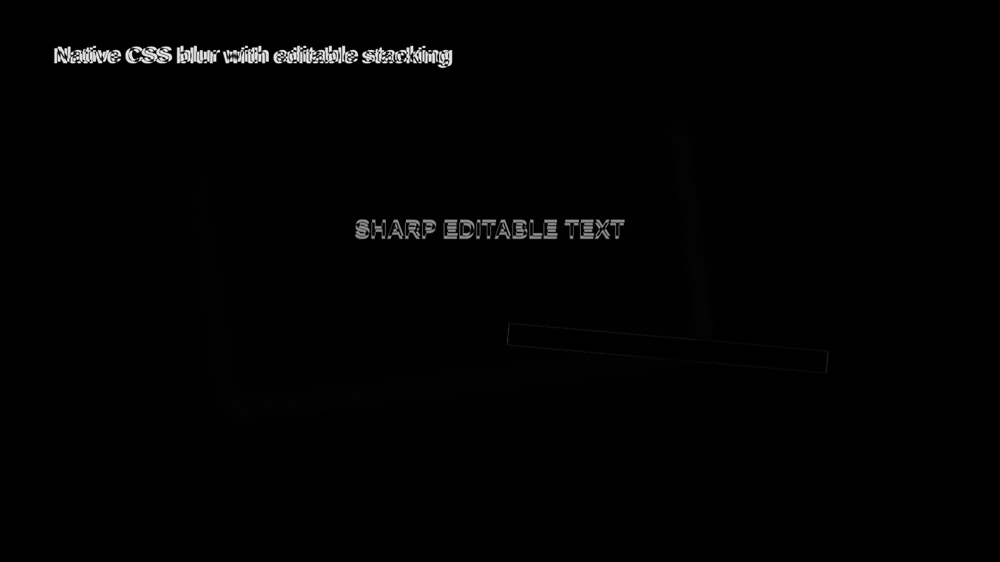
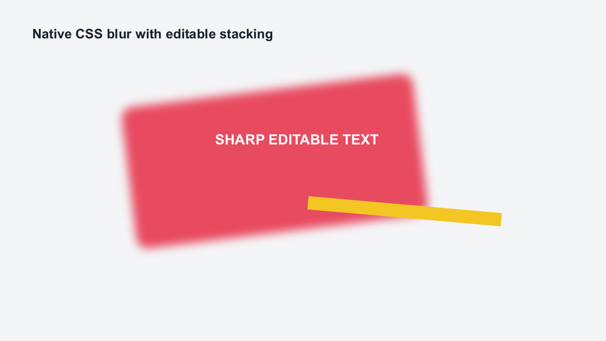
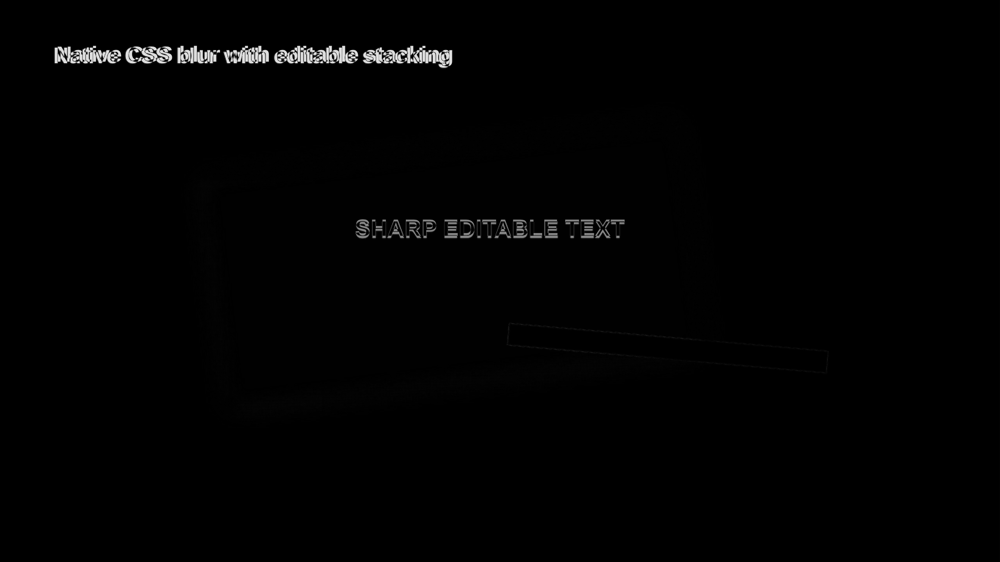
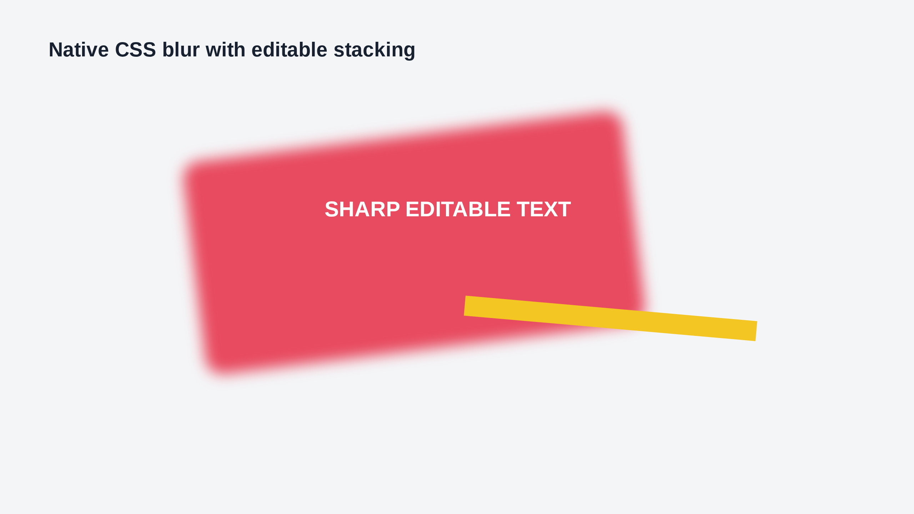
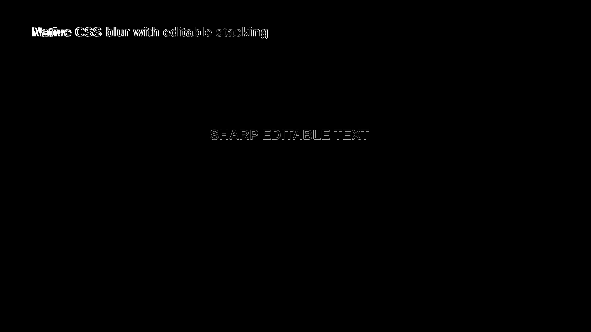

# CSS Blur Hybrid Evidence

Generated from `cap:blur-effect` at 2560x1440. The source combines CSS blur, rotation,
overlapping editable text, and a foreground shape. PowerPoint/Graph selects a PowerPoint 2015
choice containing native `a:blur` beneath the isolated paint-bound layer; LibreOffice selects the
same picture alone because its native blur rendering is incomplete.

| Path | Global | Regional | Focused | Structural |
|---|---:|---:|---:|---:|
| LibreOffice | 0.992 | 0.958 | 0.815 | 0.971 |
| Microsoft Graph | 0.992 | 0.963 | 0.834 | 0.979 |
| PPTX -> normalized HTML | 0.997 | 0.980 | 0.907 | 0.996 |

The lower focused scores expose font-metric differences in the two editable text blocks. Direct
inspection confirms that the blur paint bounds, red fill, rotation, overlap, yellow foreground bar,
and readable text remain present. The second regenerated cycle is 1.000 global/regional/structural,
with one hybrid visual, two outputs, and exactly `27988819810200` EMU2 of fallback area at every
measured boundary.

## Source

## LibreOffice

## Microsoft Graph

## Reverse HTML

