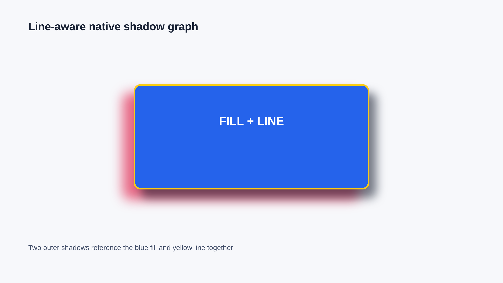
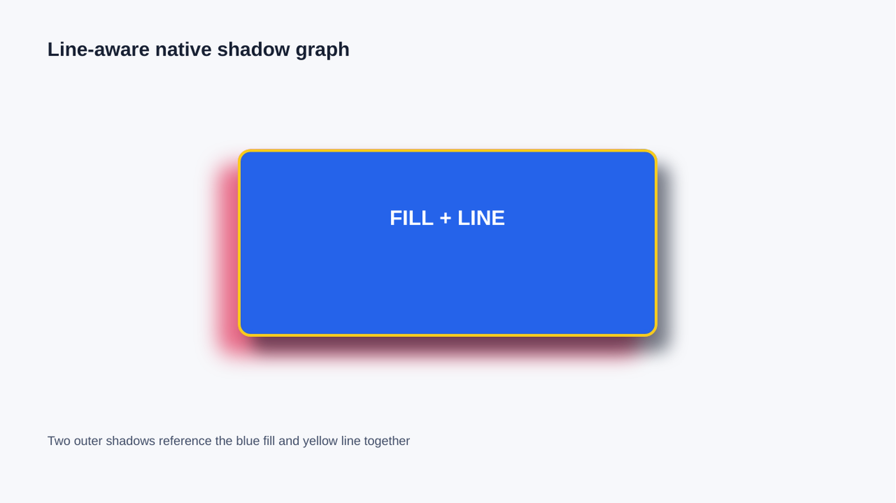
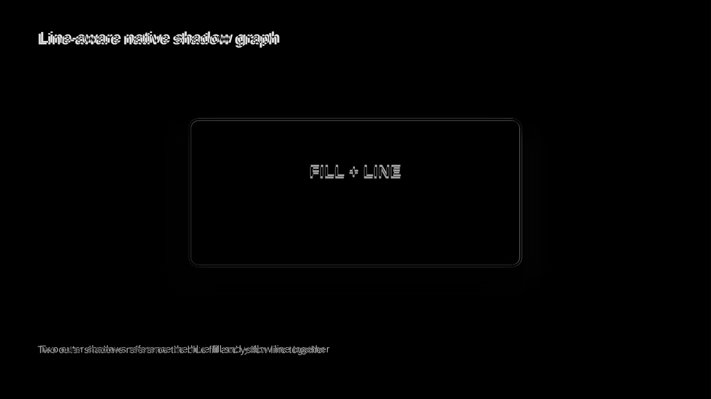
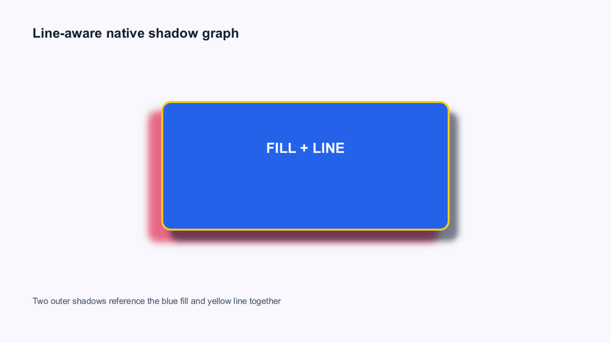
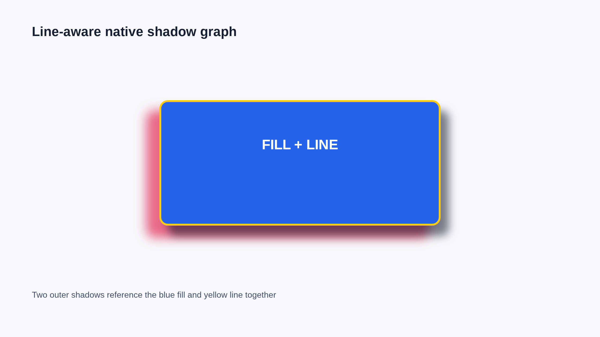
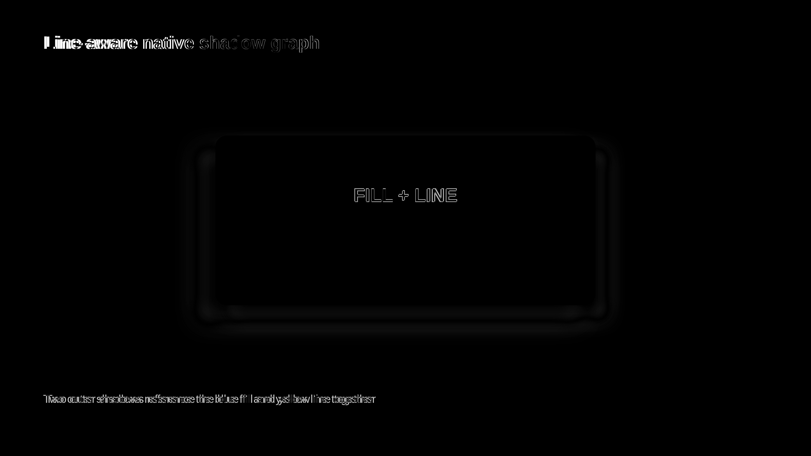
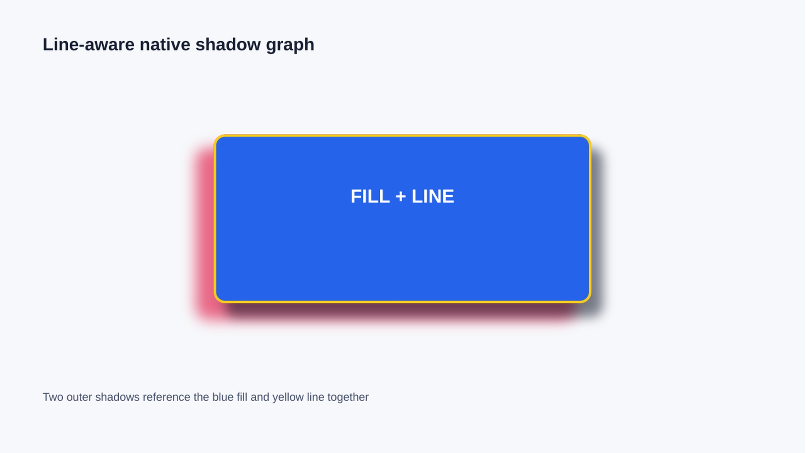
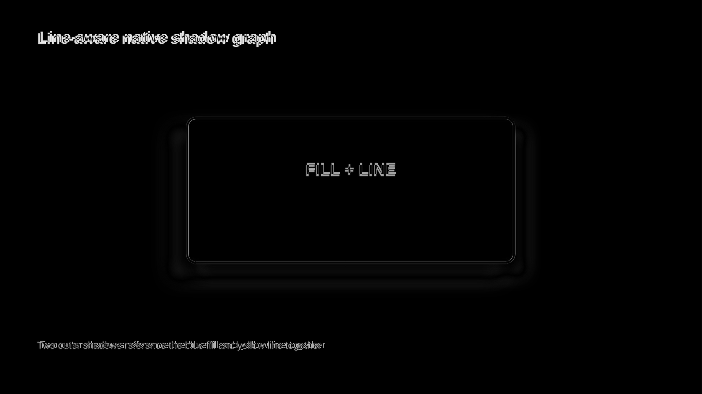
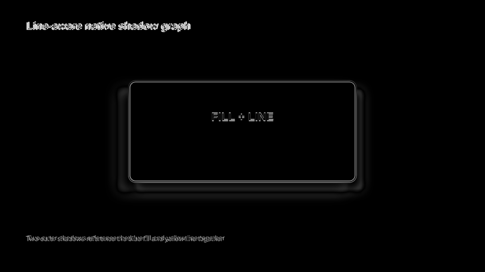

# Fill-Line Effect Graph Evidence

Generated from `cap:effect-dag-fill-line` at 2560x1440 and inspected directly in Chromium,
LibreOffice, and Microsoft Graph. The authored shape combines a blue fill, yellow 4 px line, and
two outer shadows. PowerPoint uses one editable sibling `a:effectDag` whose final child references
`fillLine`; LibreOffice uses one isolated renderer layer.

| Path | Global | Regional | Focused | Structural |
|---|---:|---:|---:|---:|
| Forward LibreOffice | 0.991 | 0.964 | 0.834 | 0.979 |
| Forward Microsoft Graph | 0.986 | 0.949 | 0.836 | 0.984 |
| PPTX -> normalized HTML | 0.994 | 0.977 | 0.913 | 0.996 |
| Rebuilt LibreOffice | 0.990 | 0.963 | 0.834 | 0.979 |
| Rebuilt Microsoft Graph | 0.986 | 0.949 | 0.836 | 0.984 |
| Normalized HTML cycle 2 | 1.000 | 1.000 | 1.000 | 1.000 |

Direct inspection confirms that the line, both shadow layers, fill, text, geometry, and stacking
remain visible in every path. Changing the graph source reference from `fillLine` to `fill` removes
the yellow line in Microsoft Graph and drops focused similarity from `0.836` to `0.822`, so the
structural XPath and visual floor reject that mutation.

This fixture exposed inherited page paint in isolated browser captures: after PPTX -> HTML -> PPTX,
LibreOffice previously showed a white rectangle around the portable layer. Isolation now forces the
root canvas and nonselected ancestors transparent, restores their styles after capture, and has a
direct alpha regression test. The rebuilt LibreOffice regional score rose from `0.957` to `0.963`,
and visual inspection confirms the rectangle is gone.

## Forward PPTX

| Chromium source | LibreOffice | Diff |
|---|---|---|
|  |  |  |

| Chromium source | Microsoft Graph | Diff |
|---|---|---|
|  |  |  |

## Reverse And Rebuilt

| Chromium source | Normalized HTML | Diff |
|---|---|---|
|  |  |  |

| Chromium source | Rebuilt LibreOffice | Diff |
|---|---|---|
|  |  |  |

| Chromium source | Rebuilt Microsoft Graph | Diff |
|---|---|---|
|  |  |  |
