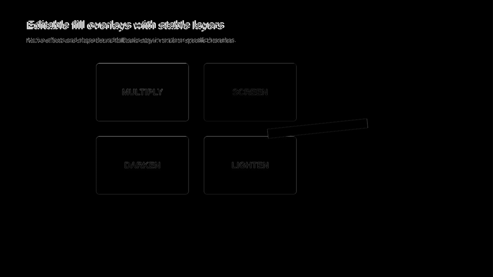
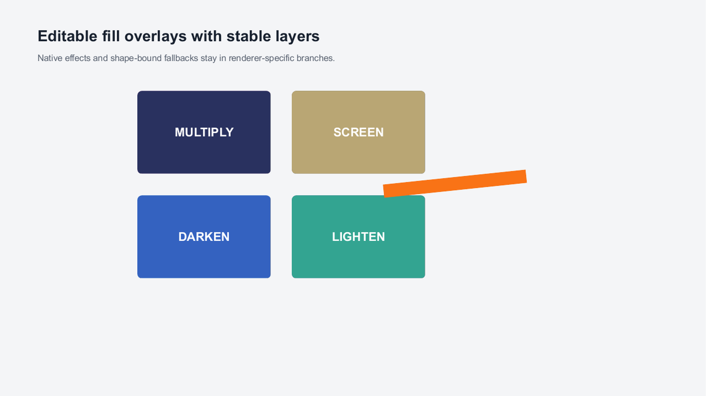
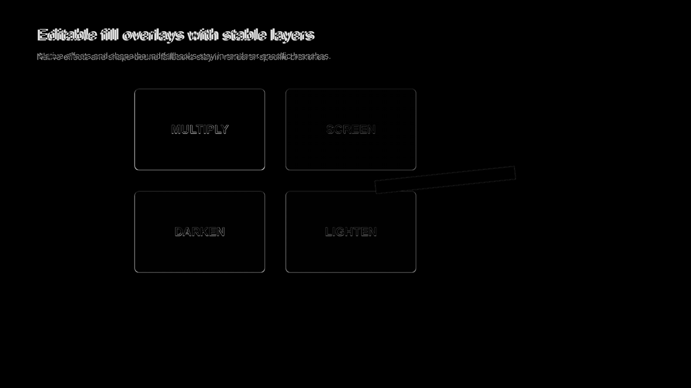
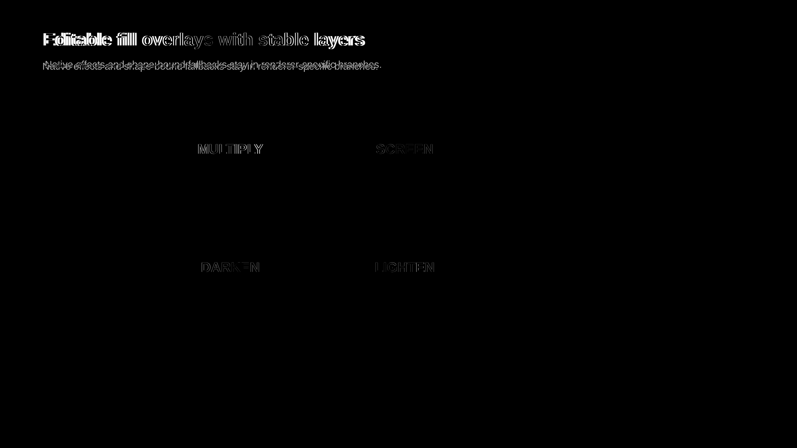
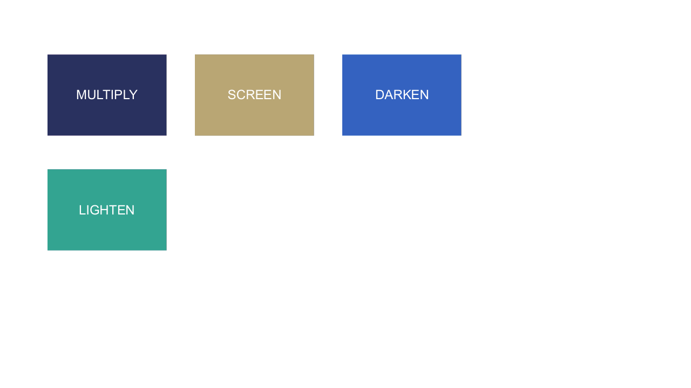
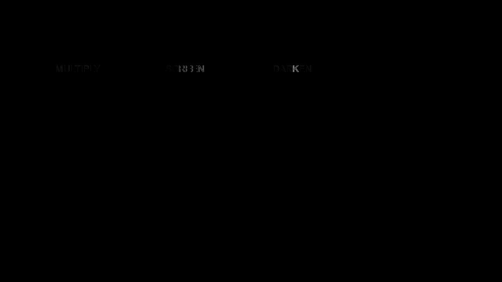
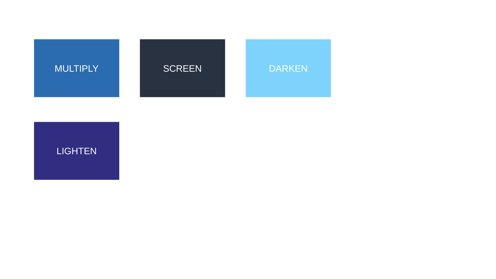
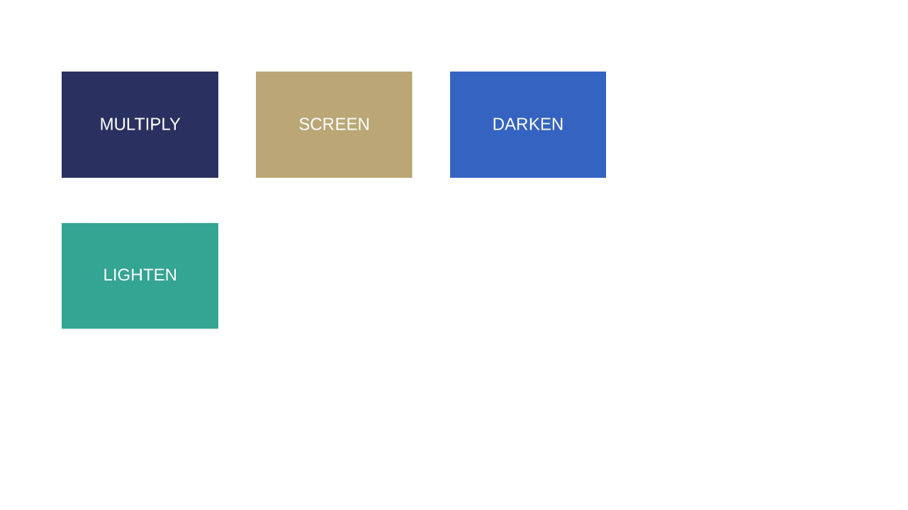
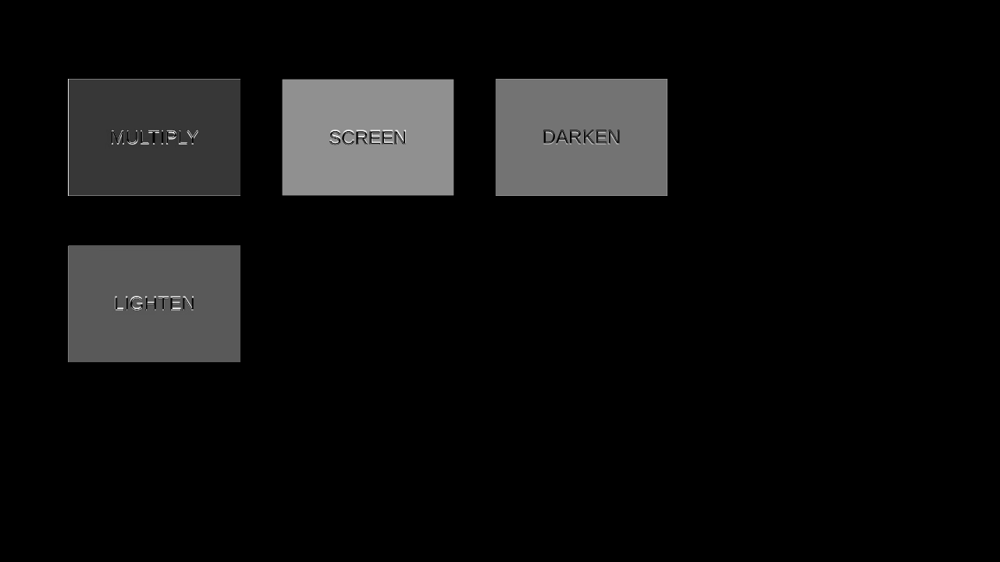

# CSS Fill Overlay Hybrid Evidence

Generated from `cap:fill-overlay-effect` at 2560x1440. The source combines editable solid
multiply, screen, darken, and lighten overlays with rounded geometry, text, and an overlapping
rotated foreground shape. PowerPoint/Graph selects the exact native `a:fillOverlay` in a PowerPoint
2015 choice; LibreOffice selects the isolated shape-bound picture in the fallback branch. The two
are intentionally renderer alternatives rather than stacked objects.

| Path | Global | Regional | Focused | Structural |
|---|---:|---:|---:|---:|
| LibreOffice | 0.991 | 0.961 | - | 0.986 |
| Microsoft Graph | 0.991 | 0.965 | 0.854 | 0.985 |
| PPTX -> normalized HTML | 0.995 | 0.976 | - | 0.993 |

Direct inspection confirms that all four blend colors, editable labels, rounded boxes, and
foreground stacking remain present. Differences are concentrated in font antialiasing and one-pixel
edges. The second regenerated cycle is 1.000 global/regional/structural, with four hybrid visuals,
four portable layers, and exactly `13064490000000` EMU2 of fallback area at every measured
boundary.

The native PowerPoint branch scores 0.991 global, 0.965 regional, 0.854 focused, and 0.985
structural. It confirms all four emitted native effects render in PowerPoint independently of the
portable LibreOffice fallback.

DrawingML `blend="over"` is deliberately outside this typed subset. Direct Graph inspection of a
solid external-producer case disproved the proposed CSS `normal` mapping, despite a misleadingly
high whole-slide score. The reader now retains that source fragment and uses the owned visible
fallback path until equivalent browser semantics are calibrated.

## Atomic Source

## LibreOffice

## Microsoft Graph

## Reverse HTML

## Native PowerPoint Branch

## External Aspose Deck

The pinned Aspose.Slides FOSS producer deck carries explicit Arial 18 pt text and one solid native
shape for each proven mode. The Microsoft Graph round trip scores 1.000 global, 1.000 regional,
0.999 focused, and 1.000 structural. Direct inspection confirms matching colors, geometry, text,
and ordering; the diff is limited to faint text antialiasing.

LibreOffice ignores every source `a:fillOverlay`, so its source image shows the four base colors.
The round-trip image instead shows domOXML's intended blended colors through the portable branch.
Both are retained below as review evidence; they are not compared as if LibreOffice's source render
represented PowerPoint semantics.

| Graph source | Graph round trip | Diff |
|---|---|---|
|  |  |  |

| LibreOffice source | LibreOffice portable output | Diff |
|---|---|---|
|  |  |  |
