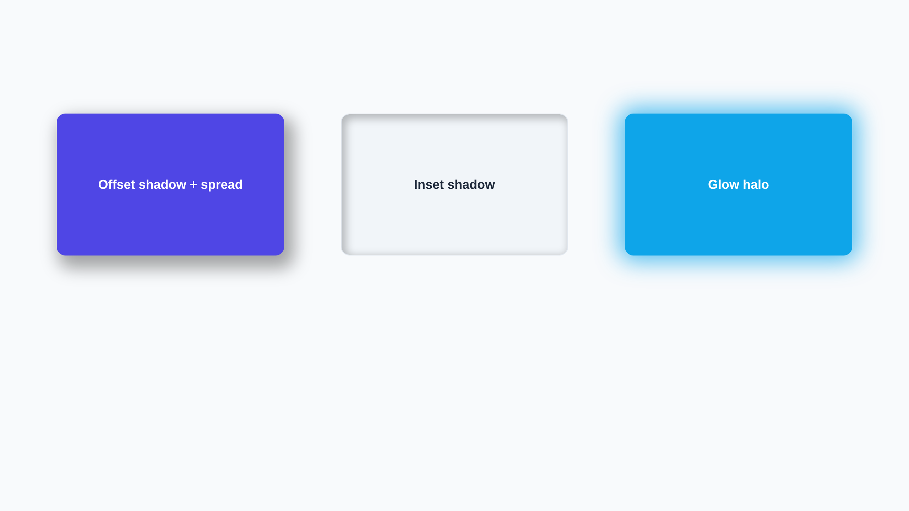
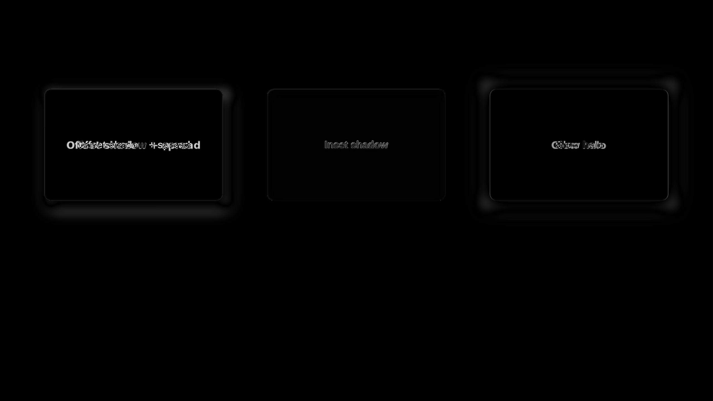
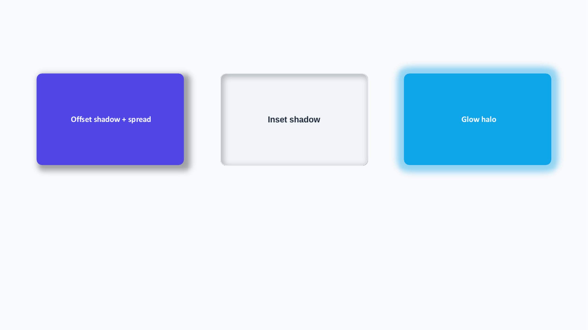
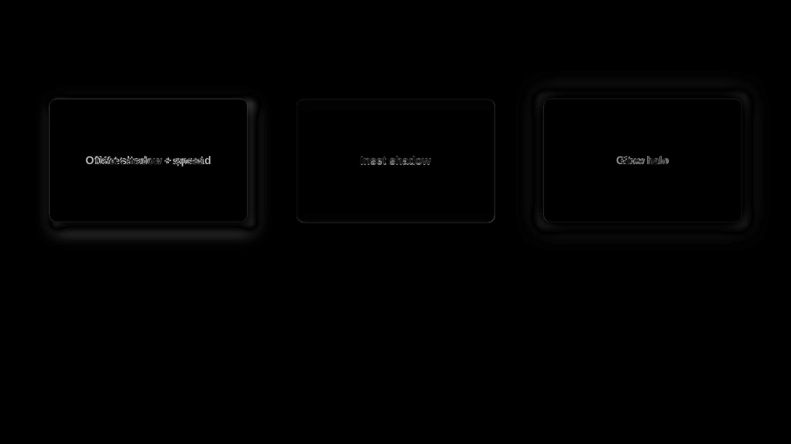
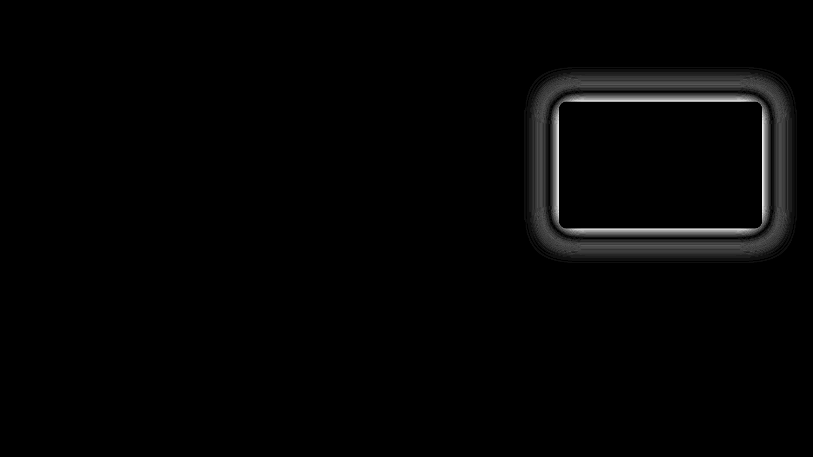
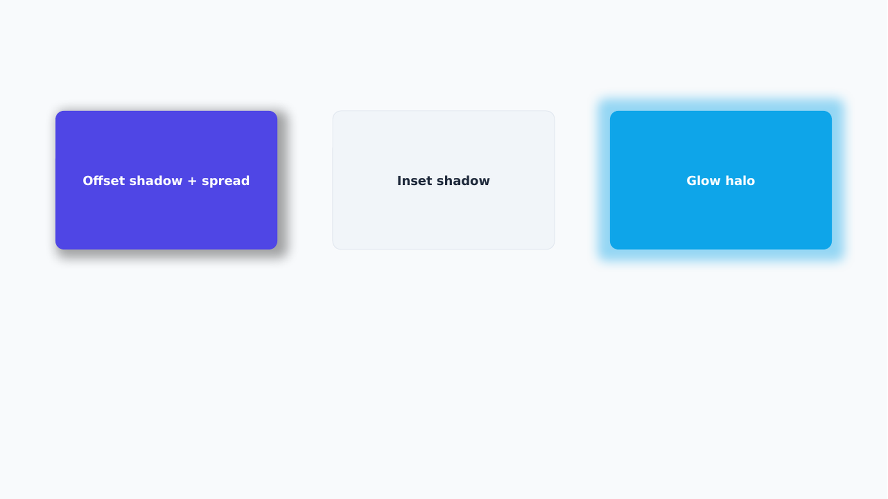
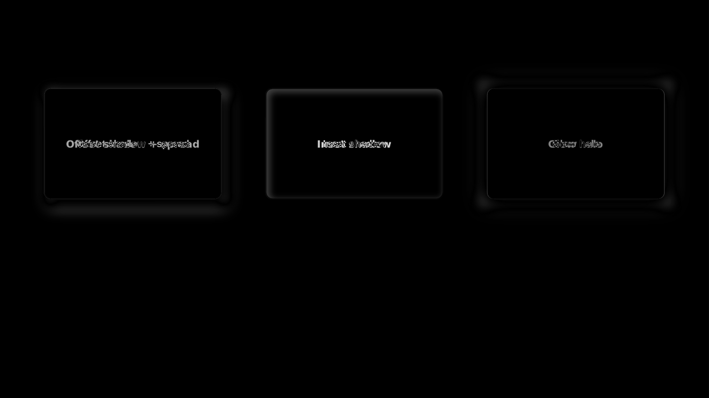
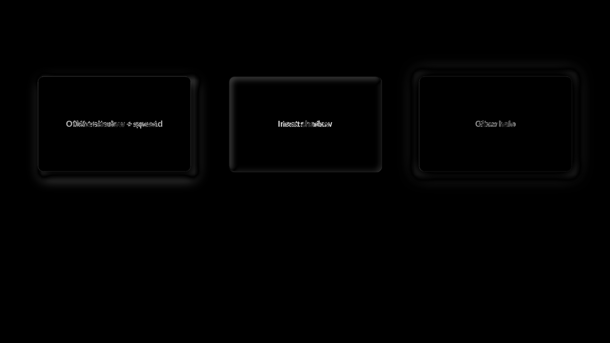

# Inset Shadow Hybrid Evidence

The `effects` capability now emits the CSS inset-shadow card as one editable native
`a:innerShdw` plus one shape-owned portable paint layer. LibreOffice selects the portable branch;
PowerPoint retains the native semantic object and the exact layer. Normalized HTML recovers the
inset CSS and exact signed spread intent rather than degrading the card to a picture.

| Render | Global | Regional | Focused | Structural |
|---|---:|---:|---:|---:|
| LibreOffice hybrid | 0.996293 | 0.983791 | 0.944347 | 0.986561 |
| Microsoft Graph hybrid | 0.996285 | 0.983791 | 0.948436 | 0.982117 |
| Normalized reverse HTML | 0.999038 | 0.990327 | 0.980642 | 0.996566 |
| LibreOffice without inset fallback | 0.994997 | 0.978301 | 0.927493 | 0.982226 |
| Microsoft Graph without inset fallback | 0.995163 | 0.980654 | 0.934668 | 0.978046 |
| Second-cycle convergence | 1.000000 | 1.000000 | 1.000000 | 1.000000 |

The capability floor is tightened to `0.940` focused similarity. Removing only the inset
fallback while retaining the native `a:innerShdw` drops LibreOffice to `0.927493`, so the gate
rejects the visible omission. Graph also demonstrates why the hybrid remains necessary: the
native effect is editable and visible, but its kernel is not exact CSS paint.

## Source

## LibreOffice

| Candidate | Diff |
|---|---|
|  |  |

## Microsoft Graph

| Candidate | Diff |
|---|---|
|  |  |

## Reverse HTML

| Candidate | Diff |
|---|---|
|  |  |

## Omission Mutation

The mutation removes the renderer-owned inset picture from `mc:AlternateContent` but leaves the
native shape and `a:innerShdw` unchanged.

| Renderer | Candidate | Diff |
|---|---|---|
| LibreOffice |  |  |
| Microsoft Graph |  |  |

## Convergence

