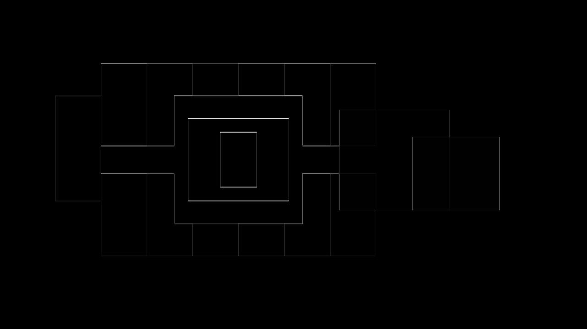
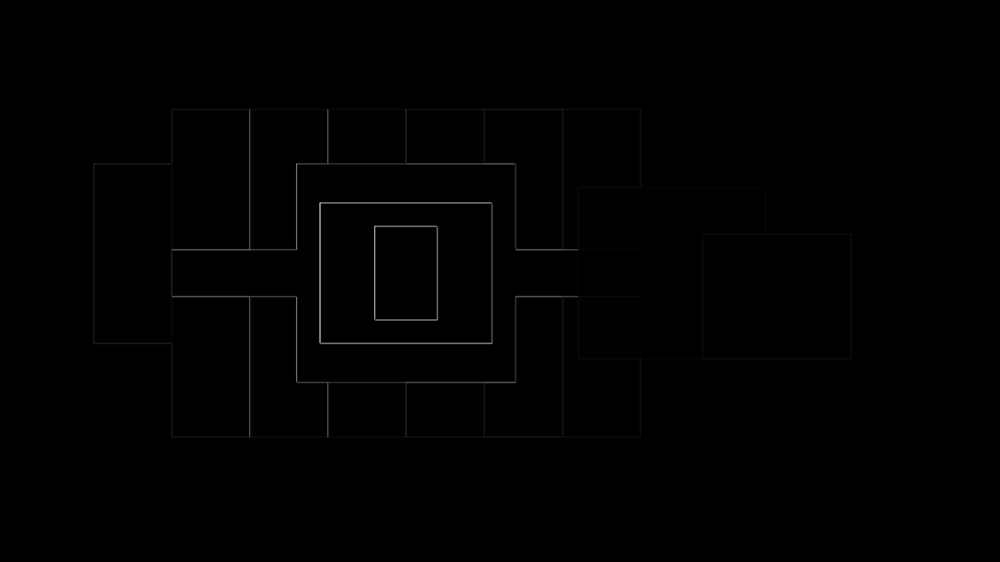
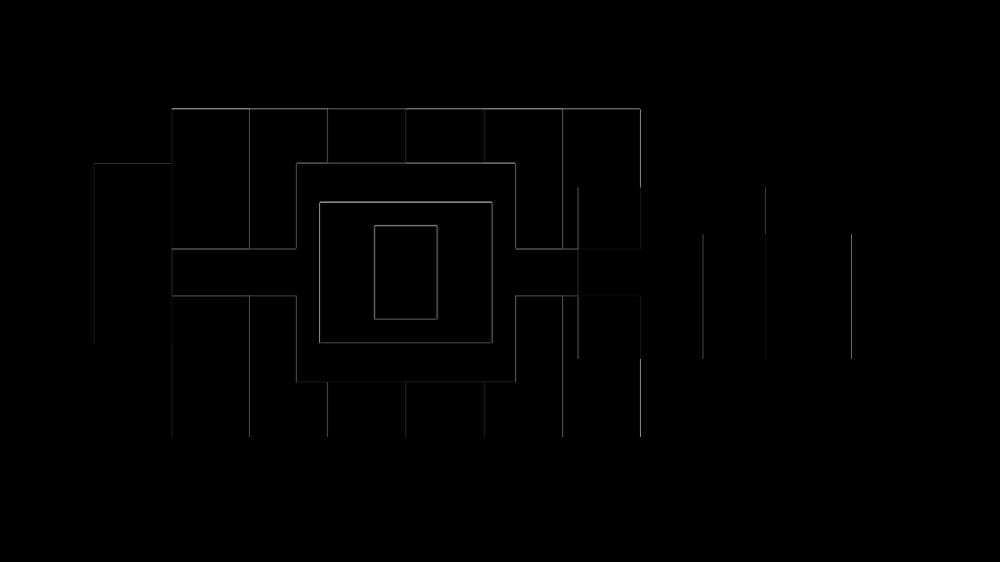

# Native group picture-child round-trip evidence

This reverse-first fixture places one cropped native `p:pic` and one translucent native shape
inside a single `p:grpSp`, between two top-level shapes. The group uses a non-unit child coordinate
space. The multicolor bitmap has hard crop markers and nested rectangular landmarks, while the
three overlapping shapes expose child order, group placement, top-level z-order, and alpha errors.

The public pipeline already wrote and directly read grouped pictures. This slice adds the missing
normalized-browser and renderer proof: PPTX ingest retains the group and picture identities,
media relationship, 12.5% left/right crop, group/child coordinate spaces, and ownership; browser
capture reconstructs the same native group; and regenerated PPTX keeps the picture as `p:pic`
inside that group rather than flattening or rasterizing it.

| Comparison | Global | Regional | Focused | Structural |
|---|---:|---:|---:|---:|
| LibreOffice PPTX to normalized HTML | 0.997 | 0.988 | 0.967 | 0.956 |
| PowerPoint/Graph PPTX to normalized HTML | 0.998 | 0.993 | 0.980 | 0.956 |
| PowerPoint/Graph source to regenerated PPTX | 1.000 | 1.000 | 1.000 | 1.000 |
| First to second normalized cycle | 1.000 | 1.000 | 1.000 | 1.000 |

Direct inspection confirms identical crop content, colors, sizing, stacking, alpha, and placement.
The source-to-HTML diffs are confined to one device pixel at hard rectangle boundaries. That is a
LibreOffice/Chromium edge-rasterization signature rather than displaced geometry: PowerPoint and
LibreOffice agree closely with one another, and the regenerated PowerPoint render is pixel-identical
to the source. The new fixture uses calibrated 0.99 global, 0.98 regional, 0.96 focused, and 0.95
structural reverse floors; no existing threshold was changed.

## Renderer and convergence evidence

| LibreOffice source | PowerPoint/Graph source | Normalized HTML |
|---|---|---|
|  |  |  |

| LibreOffice-to-HTML diff | PowerPoint-to-HTML diff | Renderer diff |
|---|---|---|
|  |  |  |

| Regenerated PowerPoint | Source-to-regenerated diff | Second-cycle diff |
|---|---|---|
|  |  |  |

`convergence.png` is the second normalized-cycle render used for direct inspection.
