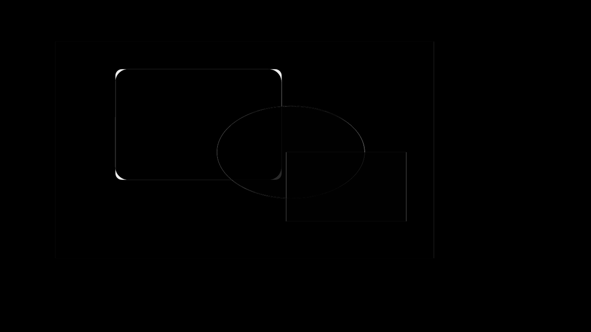
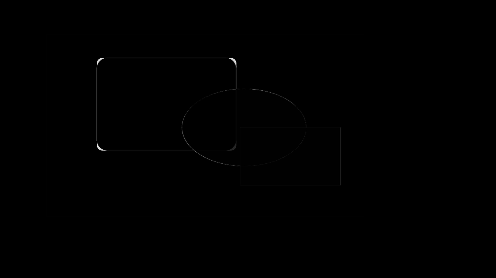

# Native group round-trip evidence

This reverse-first fixture contains one native `p:grpSp` between two top-level shapes. The group
has a non-unit child coordinate scale and owns one rounded rectangle plus one translucent ellipse;
the final translucent top-level rectangle overlaps the group. The arrangement makes group
scaling, child order, top-level z-order, and alpha mistakes directly visible.

The visually proven editable subset is deliberately narrow: a nonempty, untransformed group with
positive child extents and plain shapes that already have exact native mappings. The normalized
HTML uses a `display:contents` wrapper with a versioned group-coordinate payload, so Chromium sees
the same flat positioned paint while re-ingestion restores the group, child coordinates, stable
IDs, ownership, and native `p:grpSp` structure. A two-cycle conversion meets every declared 0.999
convergence floor.

Source groups with transforms, nested groups, connectors, portable child fallbacks, or unsupported
children do not enter this subset. Reverse input retains the complete group source graph and, when
caller-supplied renderer pixels are available, uses one slide-owned noneditable composite raster
above retained native contents. Without renderer pixels, coverage explicitly reports failed paint
while source remains attached; additional unsupported owners sharing a slide raster remain explicit
debt. The native writer emits authored grouped pictures and portable child fallbacks with their
media relationships. Valid authored transformed/connector group states visibly lower through a
flattened normalized-HTML wrapper with a warning, then restore original member geometry and group
structure over two browser cycles. Invalid extents and states that the PPTX writer cannot emit
without loss fail explicitly instead of dropping transforms or media.

Original group and member geometry is applied only while the captured wrapper/member CSS projection
and transform still match the versioned payload. A visible HTML geometry or transform edit makes
the metadata stale, so members remain flattened with an approximation warning instead of having the
edit silently overwritten. Grouped picture media/write-read behavior is unit-covered and is now
visually proven separately by the `native-group-picture-roundtrip` capability; it is not claimed by
this original plain-shape fixture.

| Comparison | Global | Regional | Focused | Structural |
|---|---:|---:|---:|---:|
| LibreOffice PPTX to normalized HTML | 0.999 | 0.995 | 0.984 | 0.982 |
| PowerPoint/Graph PPTX to normalized HTML | 0.999 | 0.995 | 0.983 | 0.976 |
| First to second normalized cycle | 1.000 | 1.000 | 1.000 | 1.000 |

Direct inspection shows identical dimensions, group scaling, child overlap order, and placement.
Visible differences are confined to one-pixel antialiasing around curved and translucent edges.

## Renderer and reverse evidence

| LibreOffice source | PowerPoint/Graph source | Normalized HTML |
|---|---|---|
|  |  |  |

| LibreOffice-to-HTML diff | PowerPoint-to-HTML diff | Second-cycle diff |
|---|---|---|
|  |  |  |

`source-graph-diff.png` separately records the small LibreOffice-versus-PowerPoint renderer-edge
difference. `convergence.png` is the second normalized-cycle candidate used for direct review.
