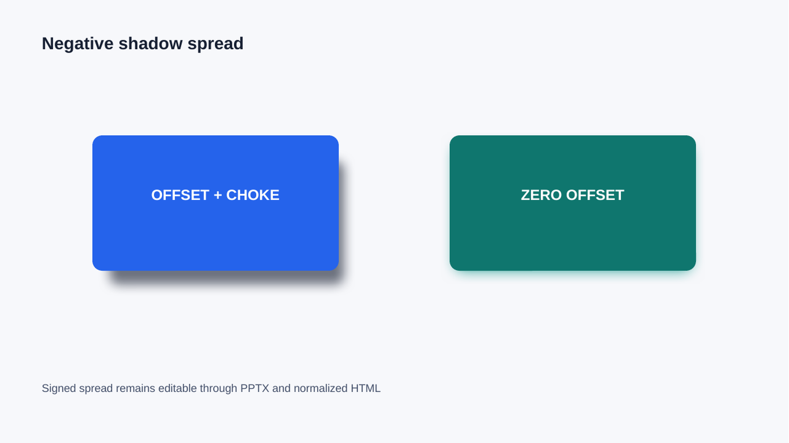
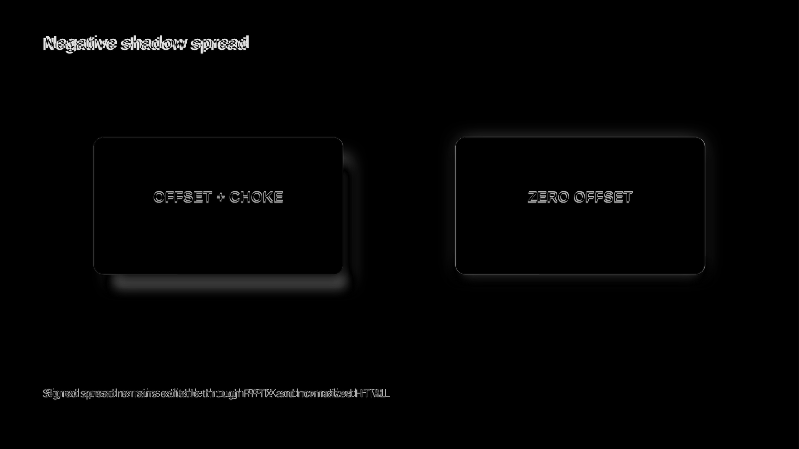
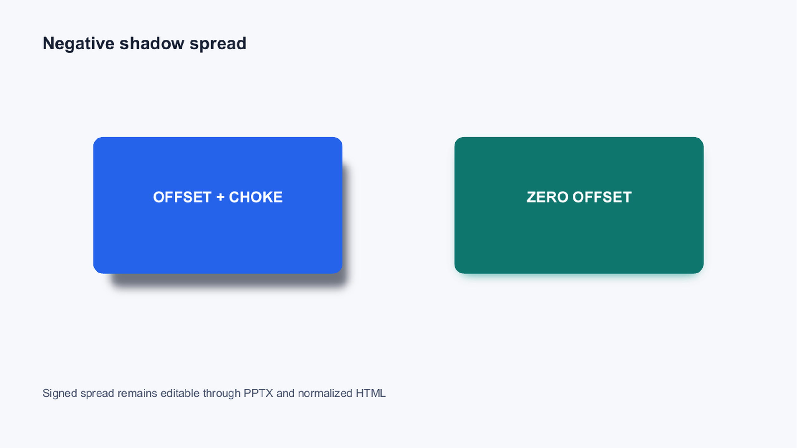
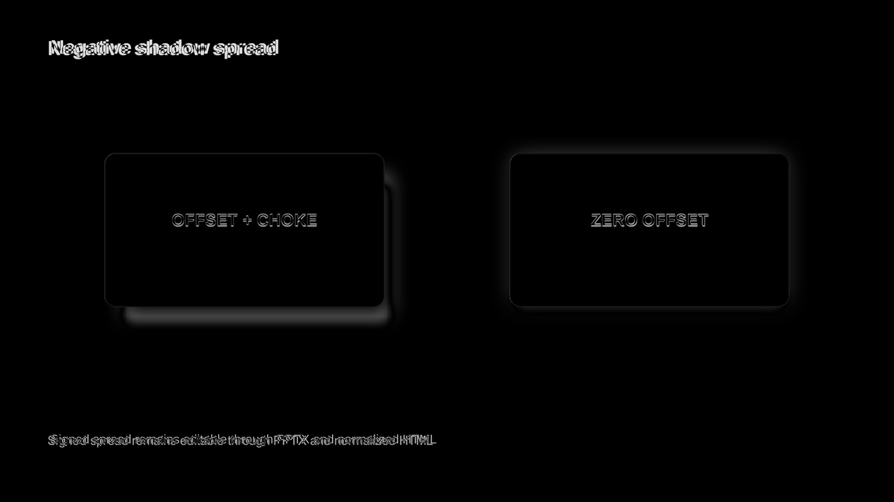
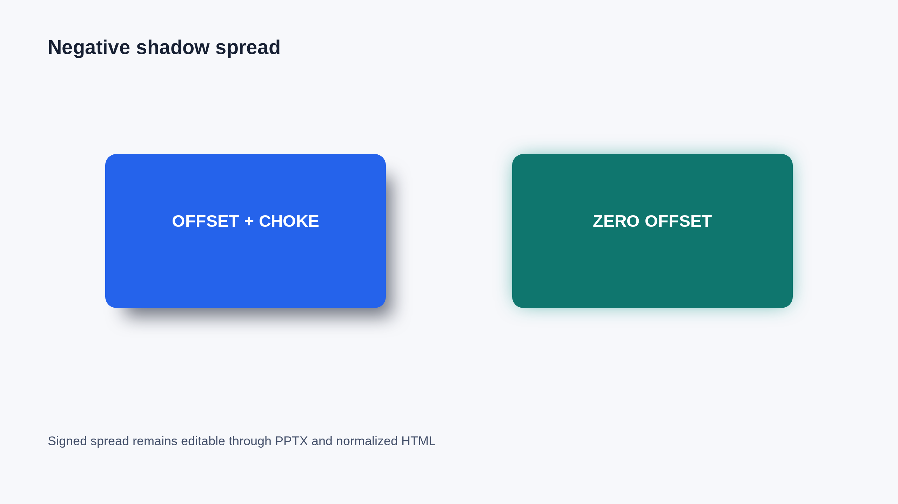
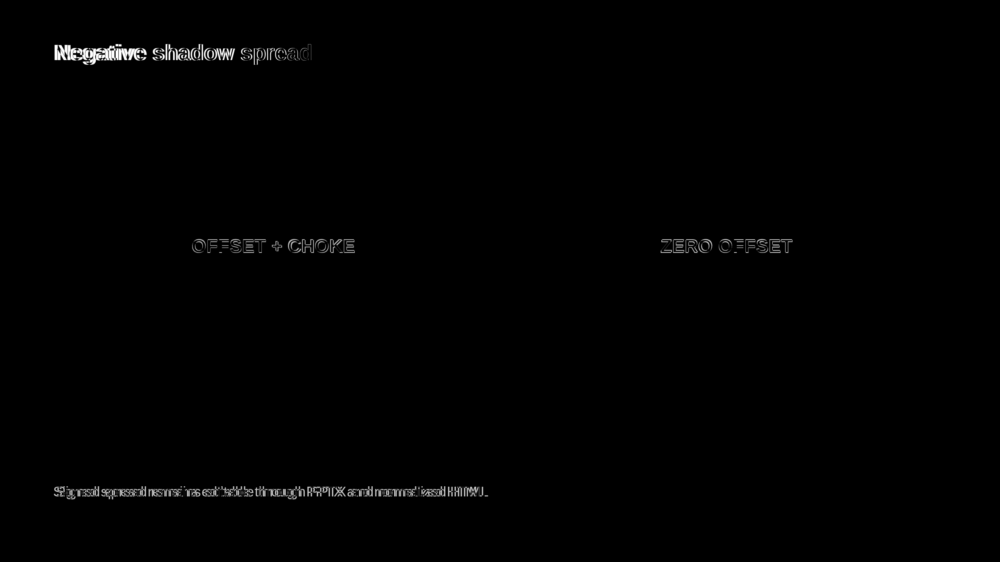
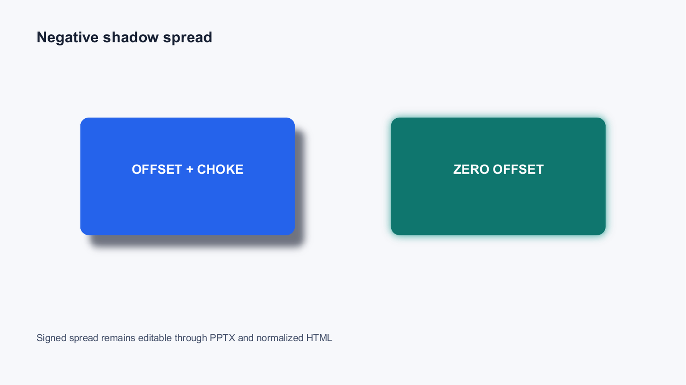
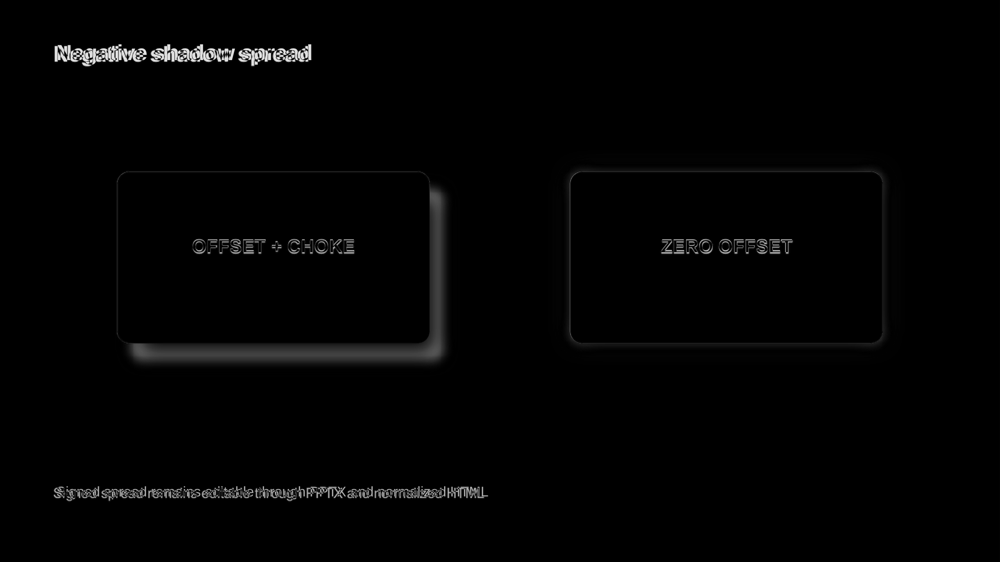

# Negative Shadow Spread Evidence

Generated from `cap:negative-shadow-spread` at 2560x1440 and inspected directly in Chromium,
LibreOffice, and Microsoft Graph. The fixture contains one offset shadow with `-10px` spread and
one zero-offset shadow with `-8px` spread. Both remain editable native `a:outerShdw` effects; the
zero-offset case must not become `a:glow`.

| Path | Global | Regional | Focused | Structural |
|---|---:|---:|---:|---:|
| Forward LibreOffice | 0.989 | 0.955 | 0.818 | 0.985 |
| Forward Microsoft Graph | 0.989 | 0.955 | 0.814 | 0.986 |
| PPTX -> normalized HTML | 0.995 | 0.980 | 0.907 | 0.996 |
| Normalized HTML cycle 2 | 1.000 | 1.000 | 1.000 | 1.000 |

Direct inspection confirms that the offset shadow keeps its choke and displacement, while the
zero-offset shadow remains a tight rectangular halo. Reverse HTML restores the authored CSS blur
after the DrawingML renderer calibration, and the typed payload rebuilds the calibrated native
effect without compounding it.

Neutralizing both `sx` and `sy` pairs to `100000` makes the shadows visibly wider. The Microsoft
Graph focused score falls from `0.814` to `0.804`, below the fixture floor of `0.810`; LibreOffice
falls from `0.818` to `0.806`. The visual gate therefore rejects omission of negative spread.

## Forward PPTX

| Chromium source | LibreOffice | Diff |
|---|---|---|
|  |  |  |

| Chromium source | Microsoft Graph | Diff |
|---|---|---|
|  |  |  |

## Reverse HTML

| Chromium source | Normalized HTML | Diff |
|---|---|---|
|  |  |  |

## Omission Mutation

| Correct Microsoft Graph | Neutralized spread | Mutation diff |
|---|---|---|
|  |  |  |
