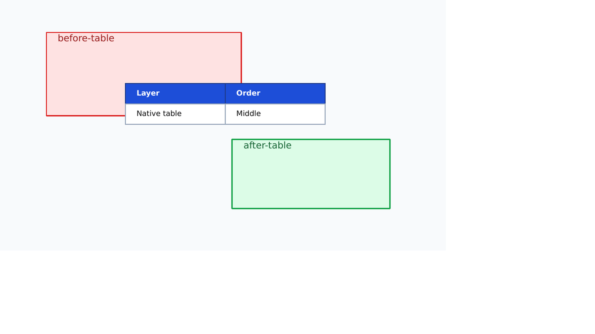
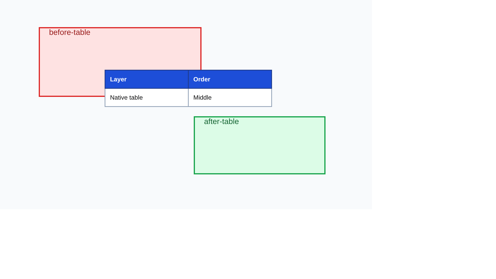

# Ordered Canvas Render Evidence

The `interleaved-order` capability places a native table between two shapes in the canonical scene
sequence. Its structural assertion requires the resulting `p:graphicFrame` to have both a preceding
and a following `p:sp` sibling.

| Chromium source | LibreOffice PPTX render | PPTX -> HTML render |
|---|---|---|
|  |  |  |

- HTML -> PPTX: global `0.992`, regional `0.962`, structural `0.954`.
- PPTX -> HTML: global `0.996`, regional `0.962`, structural `0.939`.

Direct inspection confirms the red shape remains below the table and the green shape remains after
it in the scene. Object bounds, fills, borders, and readable content survive both directions; the
remaining differences are font metrics and table column allocation. Heatmaps are committed beside
the renders.
