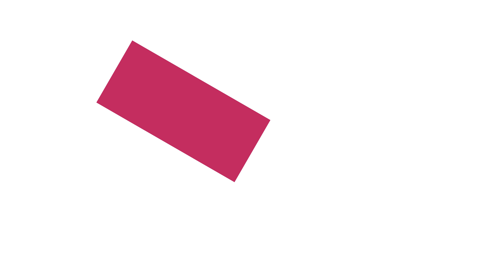
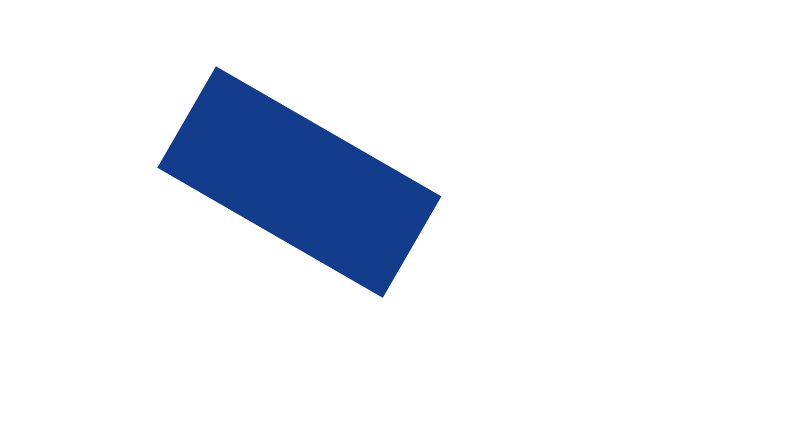
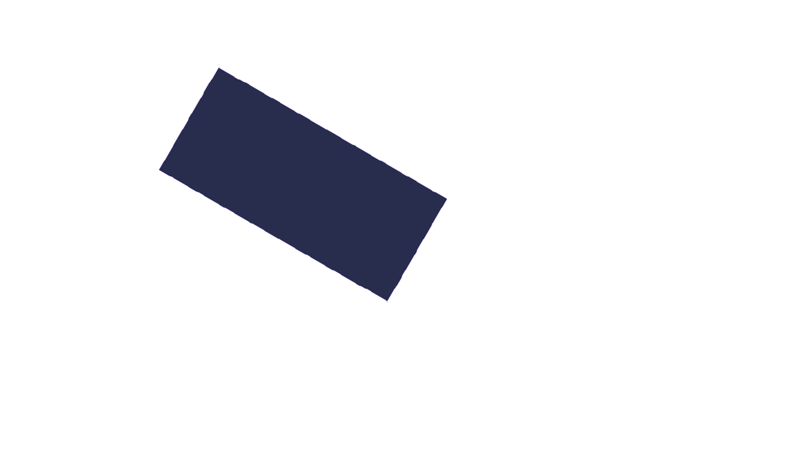
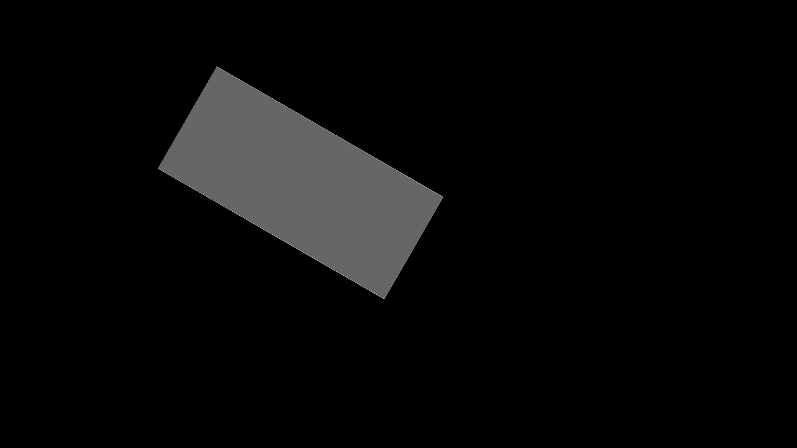
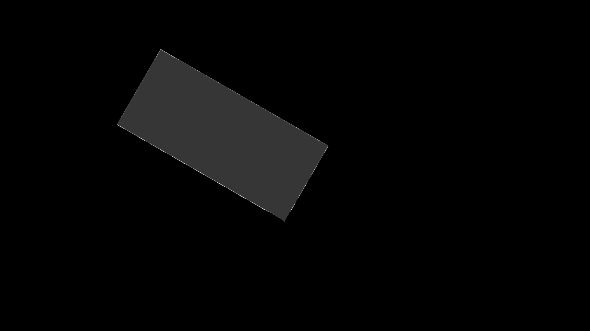
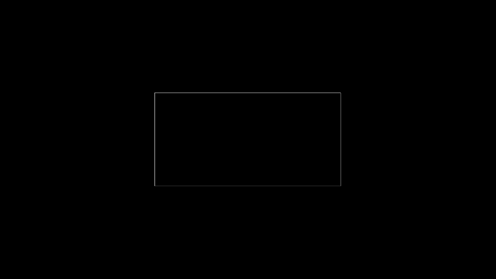
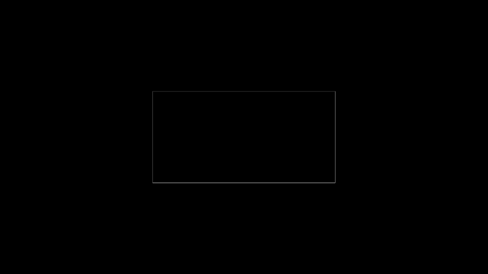
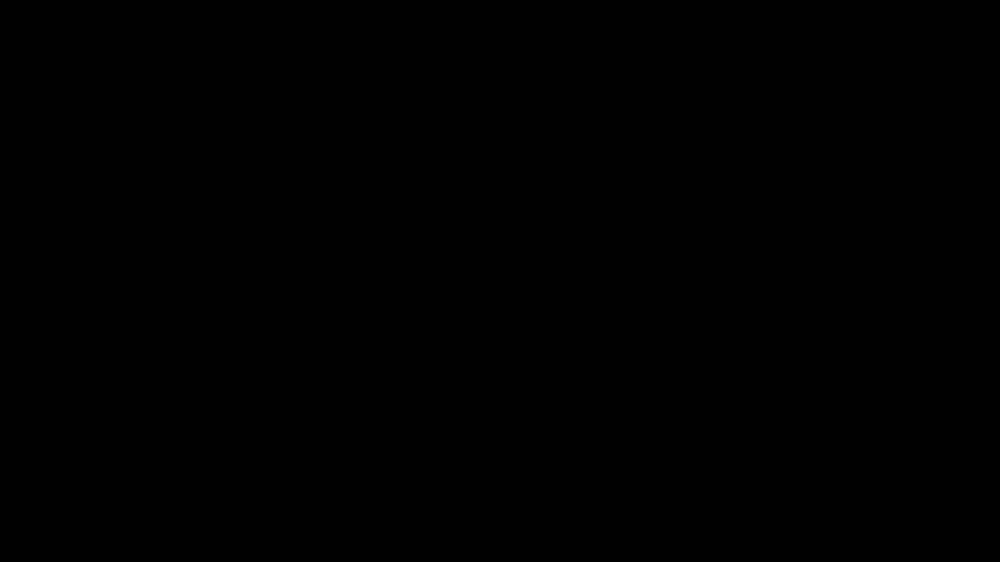

# CSS normal / DrawingML over fill-overlay evidence

This fixture uses one square-cornered rectangle with an opaque `rgb(20,60,140)` base and one
full-coverage `rgba(255,40,80,.75)` overlay. Chromium's CSS `normal` composite is
`rgb(196,45,95)` at the rectangle center.

Direct native calibration disproves a native-only mapping:

| Native `a:fillOverlay blend="over"` renderer | Center RGB | Global | Regional | Focused | Structural |
|---|---:|---:|---:|---:|---:|
| LibreOffice | `(20,60,140)` | 0.973 | 0.798 | 0.737 | 0.999 |
| Microsoft Graph / PowerPoint | `(40,44,77)` | 0.980 | 0.850 | 0.808 | 0.998 |

LibreOffice ignores the native overlay. PowerPoint paints a dark indigo with different compositing
semantics. The high whole-slide and structural scores are misleading because most pixels are white
and the rectangle geometry is unchanged; the regional, focused, center-color, and direct visual
checks expose the paint failure.

domOXML therefore retains the editable native `over` effect as private guarded intent beneath one
exact shape-owned picture. Both the PowerPoint choice and LibreOffice fallback select that picture,
so neither renderer can double-paint the translucent result. The admitted authoring subset is only
a plain, untransformed, fully opaque solid rectangular base plus one translucent uniform solid
overlay with default, full-shape background geometry. Element opacity, additional effects,
borders, text, gradient and pattern overlays, picture or translucent bases, partial coverage, and
rounded or clipped geometry stay outside the typed subset. Reverse recovery also verifies the
hidden state, native base composite, rectangular geometry, and native/fallback bounds before
trusting private intent, and requires the generated fallback branch to contain exactly that one
tagged picture.

| Exact hybrid path | Global | Regional | Focused | Structural |
|---|---:|---:|---:|---:|
| LibreOffice | 0.999 | 0.995 | 0.979 | 0.983 |
| Microsoft Graph / PowerPoint | 0.999 | 0.996 | 0.984 | 0.978 |
| PPTX to normalized HTML | 1.000 | 1.000 | 1.000 | 1.000 |
| Second normalized cycle | 1.000 | 1.000 | 1.000 | 1.000 |

Direct inspection shows that the LibreOffice and Graph differences are confined to a one-pixel
rectangle perimeter. The fill color, alpha composite, position, size, and stacking are intact.
The typed effect, portable role, fallback bytes, hybrid coverage, two output objects, and exact
`10451592000000` EMU2 raster area survive reverse conversion and two normalized cycles. If the
native projection no longer matches its private intent after an Office edit, the reader rejects
the stale typed metadata and retains the source `AlternateContent` as an attached element layer.

## Native calibration

| Chromium CSS normal | LibreOffice native `over` | Microsoft Graph native `over` |
|---|---|---|
|  |  |  |

| LibreOffice native diff | Microsoft Graph native diff |
|---|---|
|  |  |

## Exact hybrid

| Chromium source | LibreOffice | Microsoft Graph |
|---|---|---|
|  |  |  |

| LibreOffice diff | Microsoft Graph diff |
|---|---|
|  |  |

## Reverse and convergence

| Normalized HTML | Normalized HTML diff | Second-cycle diff |
|---|---|---|
|  |  |  |
