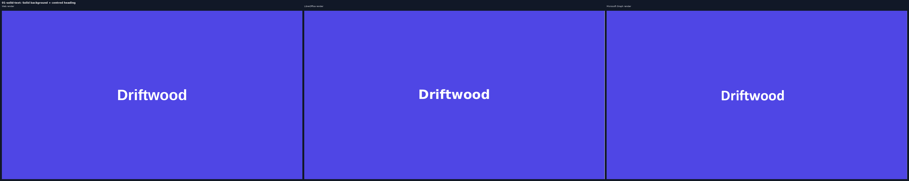
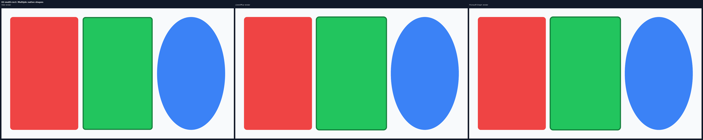
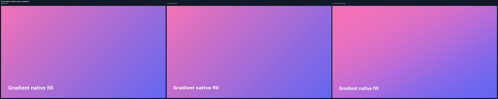
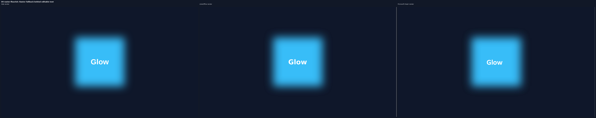
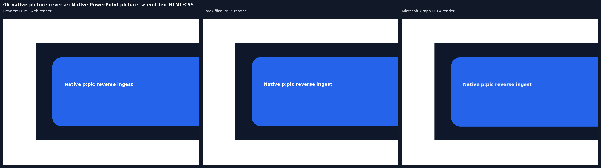

# PPTX / HTML Reverse Baseline Visual Review

Each comparison uses equal-sized panels:

1. Browser-rendered HTML source, or emitted HTML for the reverse-ingest example.
2. LibreOffice-rendered PPTX.
3. Microsoft Graph-rendered PPTX using the real PowerPoint-backed rendition path.

| Case | LibreOffice | Microsoft Graph |
| --- | ---: | ---: |
| Solid text | 0.997 | 0.996 |
| Native shapes | 0.993 | 0.993 |
| Native gradient | 0.996 | 0.971 |
| Raster fallback | 0.998 | 0.998 |
| Rich text runs | 0.995 | 0.996 |

## Forward Fidelity Corpus

## Reverse Ingest

The first panel below is HTML/CSS emitted after ingesting a native PowerPoint `p:pic`.

