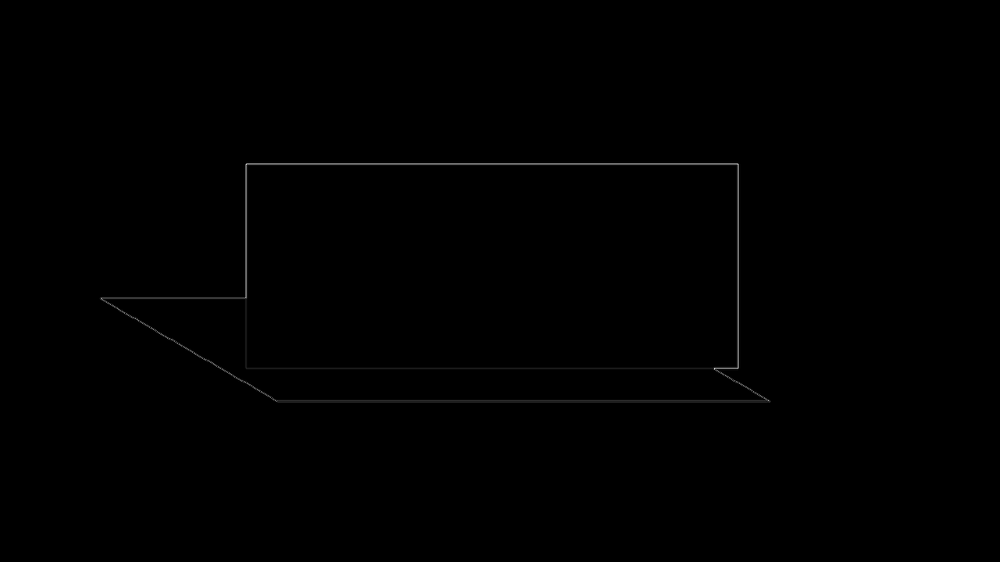
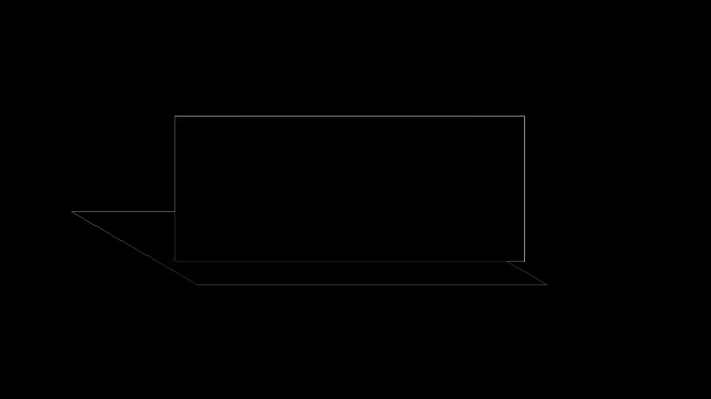

# Preset Shadow Raster Fallback Evidence

The reverse-first fixture contains PowerPoint preset shadow `shdw3`, a perspective geometry with
no exact CSS equivalent. PowerPoint/Graph renders the full perspective shadow; LibreOffice omits
every tested `a:prstShdw` preset from the native source.

Because the shape is the slide's sole visual, domOXML retains the exact native shape and effect for
PowerPoint and safely records one full-slide renderer fallback as `rasterized`/noneditable with
attached source. The rebuilt package selects the native shape in PowerPoint and the tagged picture
in incompatible renderers. Re-ingestion retains the complete `AlternateContent` payload and
unchanged fallback bytes, so the next normalized HTML cycle is pixel-identical. Multi-visual slides
do not attach a composite full-slide raster at one shape's z-order.

| Boundary | Global | Regional | Focused | Structural |
|---|---:|---:|---:|---:|
| PPTX -> normalized HTML | 1.000 | 1.000 | - | 0.921 |
| Rebuilt PPTX -> LibreOffice | 0.999 | 0.994 | 0.977 | 0.917 |
| Rebuilt PPTX -> Microsoft Graph | 1.000 | 1.000 | 1.000 | 1.000 |
| Normalized HTML cycle 2 | 1.000 | 1.000 | - | 1.000 |

The initial structural difference is a one-pixel perimeter caused by browser image decoding.
Direct comparison against LibreOffice's missing-shadow source scores only 0.976 global, 0.791
regional, 0.403 focused, and 0.770 structural, so the executable gate rejects omission with a wide
margin.

## Source Renderer Difference

| Microsoft Graph source | LibreOffice source |
|---|---|
|  |  |

## Reverse HTML

| Graph source | Normalized HTML fallback | Diff |
|---|---|---|
|  |  |  |

## Rebuilt PPTX

| Graph source | Rebuilt LibreOffice | Diff |
|---|---|---|
|  |  |  |

| Graph source | Rebuilt Microsoft Graph | Diff |
|---|---|---|
|  |  |  |
