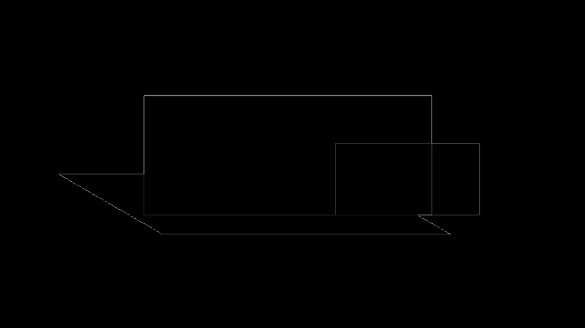
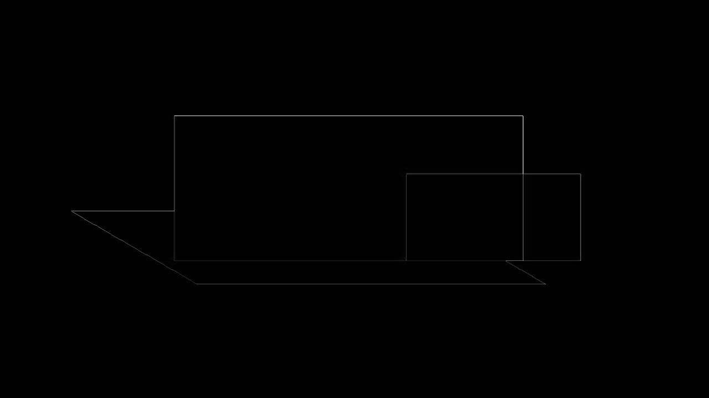

# Preset Shadow Slide Fallback Evidence

The reverse-first fixture combines PowerPoint preset shadow `shdw3` with a later translucent
sibling that overlaps both the blue source shape and its perspective shadow. A node-owned
full-slide picture would corrupt that stacking boundary by baking the sibling once and painting it
again. domOXML instead retains the exact preset-shadow shape and native sibling in their original
order, then records one explicit slide-level renderer fallback.

Normalized HTML keeps the native objects beneath one final full-slide image. Rebuilt PPTX wraps the
whole native visual sequence in `mc:Choice` and places one tagged picture in `mc:Fallback`.
PowerPoint/Graph therefore keeps native editable objects, while LibreOffice selects the already
composited pixels once. Re-ingestion recovers the same source payload, sibling, and fallback bytes.

| Boundary | Global | Regional | Focused | Structural |
|---|---:|---:|---:|---:|
| PPTX -> normalized HTML | 1.000 | 1.000 | 1.000 | 0.928 |
| Rebuilt PPTX -> LibreOffice | 0.999 | 0.993 | 0.978 | 0.926 |
| Rebuilt PPTX -> Microsoft Graph | 1.000 | 1.000 | 1.000 | 1.000 |
| Normalized HTML cycle 2 | 1.000 | 1.000 | 1.000 | 1.000 |

LibreOffice's native missing-shadow source scores only 0.976 global, 0.791 regional, 0.403 focused,
and 0.804 structural against the Graph reference. The executable `0.90` structural gate therefore
rejects omission while allowing the one-pixel browser/LibreOffice antialiasing perimeter visible in
the diffs.

## Source Renderer Difference

| Microsoft Graph source | LibreOffice source |
|---|---|
|  |  |

## Reverse HTML

| Graph source | Normalized HTML slide fallback | Diff |
|---|---|---|
|  |  |  |

## Rebuilt PPTX

| Graph source | Rebuilt LibreOffice | Diff |
|---|---|---|
|  |  |  |

| Graph source | Rebuilt Microsoft Graph | Diff |
|---|---|---|
|  |  |  |
