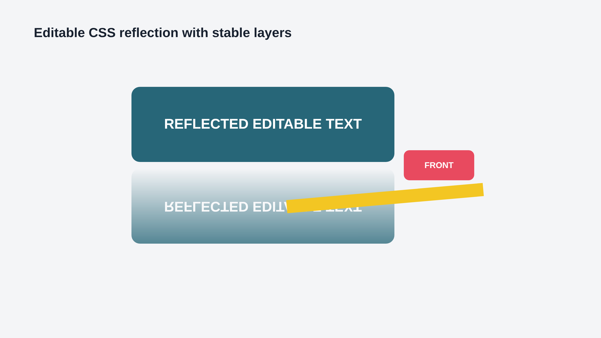
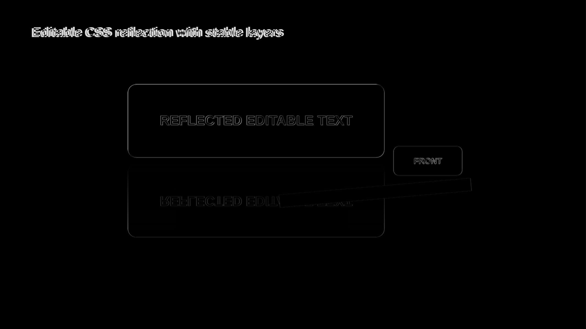
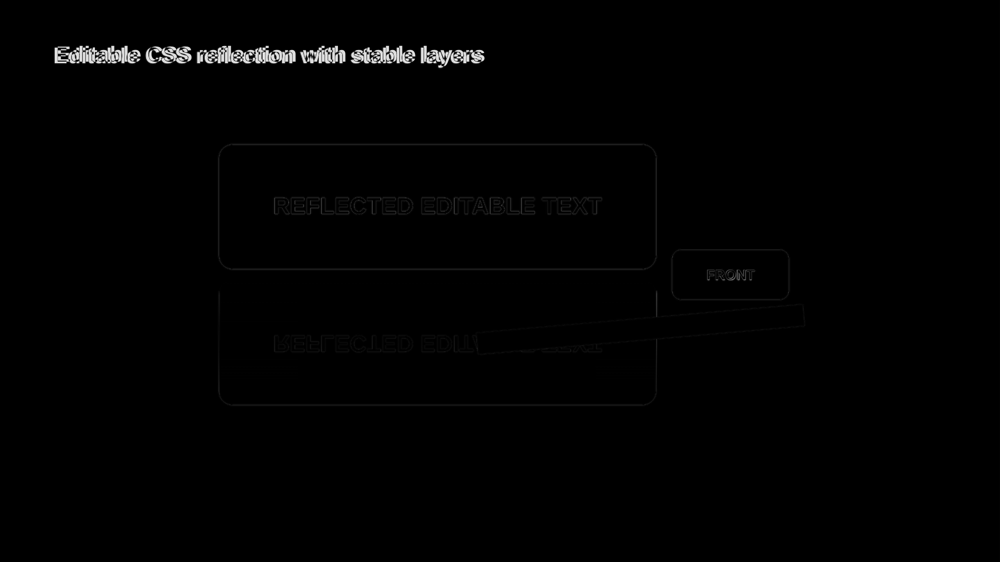
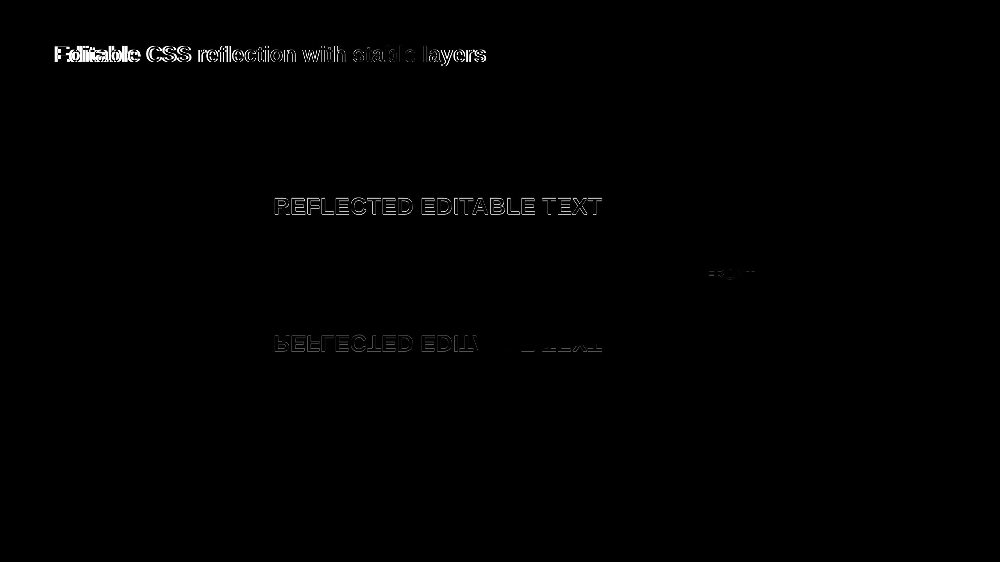
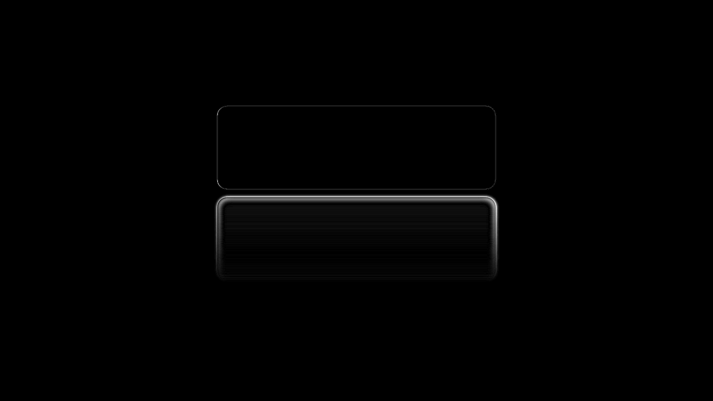

# CSS Reflection Hybrid Evidence

Generated from `cap:reflection-effect` at 2560x1440. The source combines a reflected rounded
shape, editable text, an alpha-faded reflection mask, a transformed foreground bar, and an
overlapping foreground badge. PowerPoint/Graph selects a PowerPoint 2015 choice containing native
`a:reflection` beneath the isolated paint-bound layer; LibreOffice selects the same picture alone.

| Path | Global | Regional | Focused | Structural |
|---|---:|---:|---:|---:|
| LibreOffice | 0.992 | 0.965 | 0.839 | 0.986 |
| Microsoft Graph | 0.993 | 0.969 | 0.851 | 0.988 |
| PPTX -> normalized HTML | 0.996 | 0.978 | 0.908 | 0.998 |

The focused differences are concentrated in editable text metrics and edge antialiasing. Direct
inspection confirms that the reflection direction, 14 px gap, mask fade, rounded geometry, fill,
text, and stacking remain present. The second regenerated cycle is 1.000
global/regional/focused/structural, with one hybrid visual, two outputs, and exactly
`16969320900000` EMU2 of fallback area at every measured boundary.

A separate native PowerPoint reflection with 7 px independent blur was rendered through Microsoft
Graph, read into the same IR, and emitted as normalized HTML. That reverse path scores 0.998 global,
0.987 regional, 0.956 focused, and 0.938 structural. Direct inspection confirms the rounded fill,
14 px offset, independent blur, and complete fade remain visible; the amplified diff is concentrated
around the renderer-specific soft edge distribution.

## Source

## LibreOffice

## Microsoft Graph

## Reverse HTML

## Native Blurred Reflection

