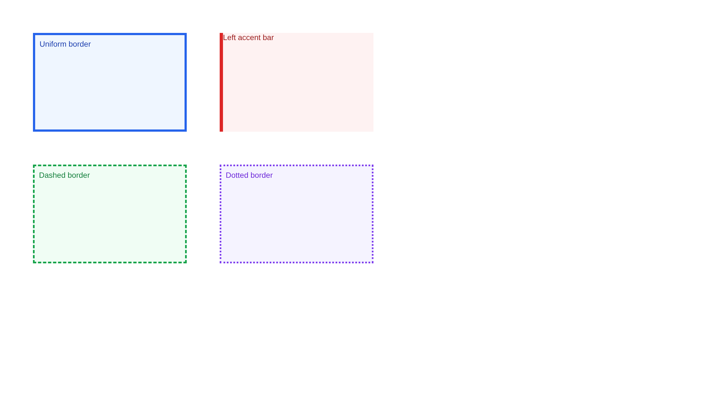
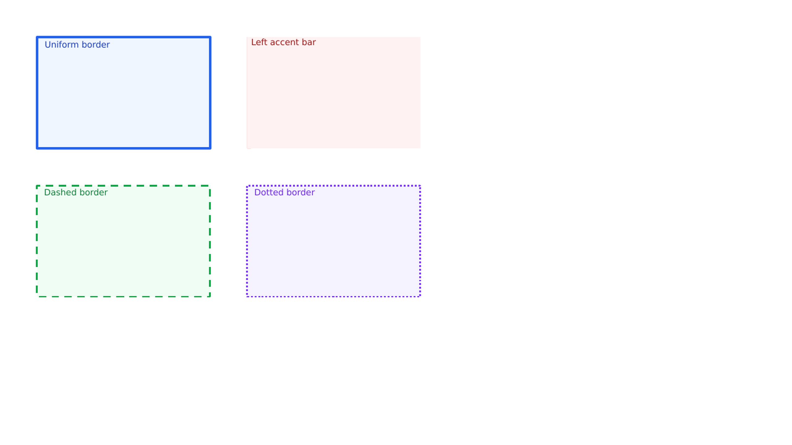
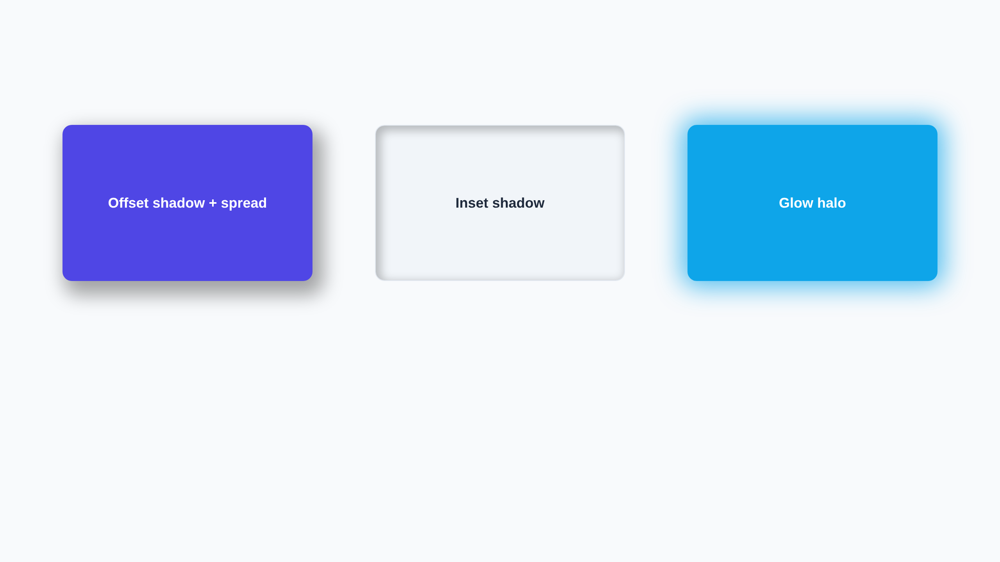
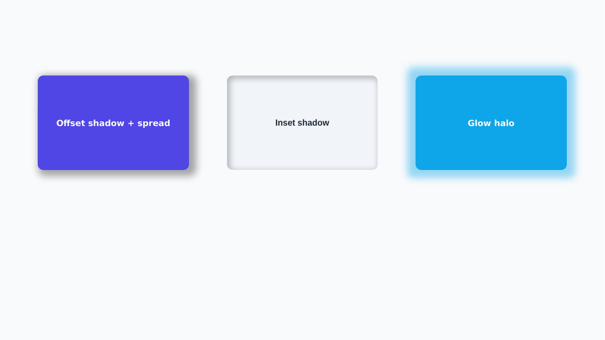
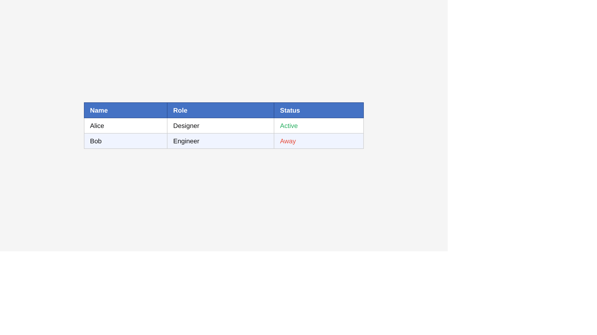
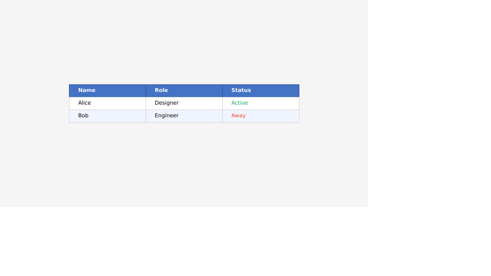

# Representation Contract Render Evidence

These Chromium source and LibreOffice candidate renders were generated by
`scripts/capability_check.py` from the branch that introduced typed representation coverage. The
fixture output is unchanged; the pairs prove the new contract classifies existing output without a
visual regression. One uncovered edge case now rasterizes an unrepresentable custom-SVG fill rather
than silently omitting that fill.

## Borders

| Chromium source | LibreOffice candidate |
|---|---|
|  |  |

Global `0.993`, regional `0.970`, structural `0.968`. Direct inspection confirms matching object
bounds, fills, colors, border widths, and accent-bar decomposition. LibreOffice uses a different
dash cadence and slightly different font rasterization.

## Effects

| Chromium source | LibreOffice candidate |
|---|---|
|  |  |

Global `0.996`, regional `0.983`, structural `0.987`. Direct inspection confirms that offset/spread,
the inset shadow, and the glow halo all remain visible at the intended objects. Blur kernels and text
rasterization differ slightly between Chromium and LibreOffice.

## Table

| Chromium source | LibreOffice candidate |
|---|---|
|  |  |

Global `0.998`, regional `0.983`, structural `0.961`. Direct inspection confirms readable text,
matching overall table bounds, row heights, fills, borders, and status colors. Column allocation and
font metrics show small renderer differences.

## Bullets

| Chromium source | LibreOffice candidate |
|---|---|
|  |  |

Global `0.992`, regional `0.950`, structural `0.945`. Direct inspection confirms bullet glyphs remain
before their text, nested indentation remains nested, and the ordered list remains below the bullet
list. Glyph and font rasterization differ slightly.

The corresponding heatmaps are committed as `*-diff.png` files in this directory.
