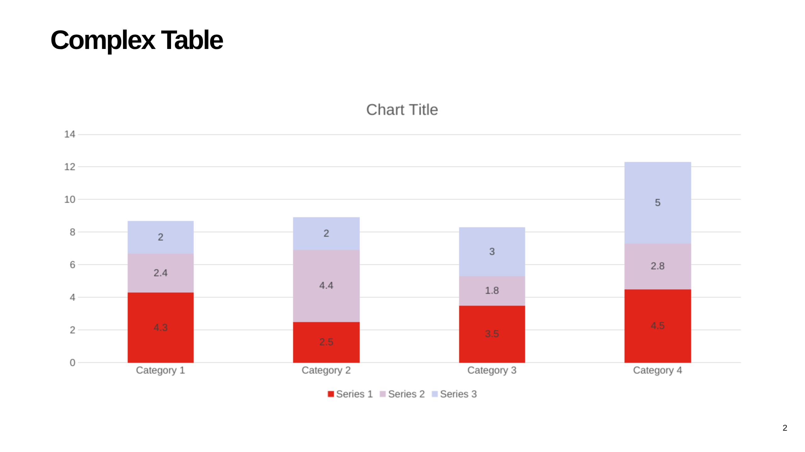
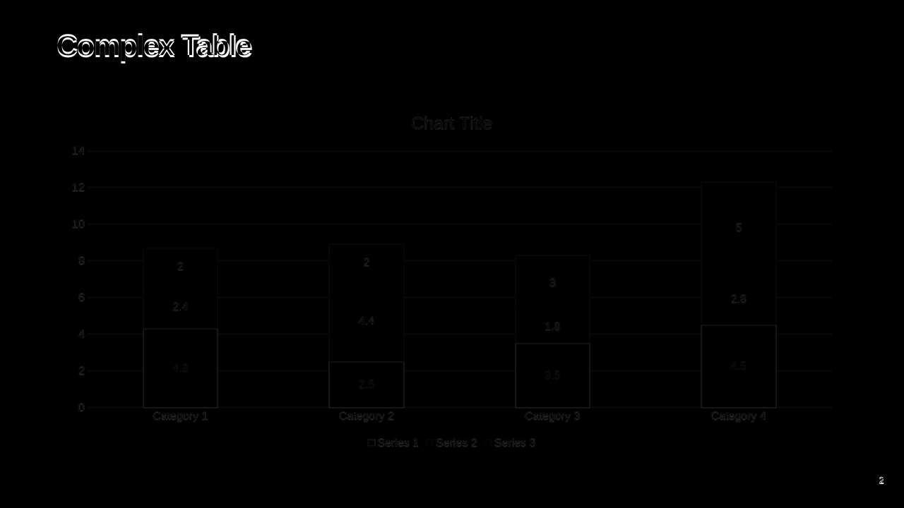
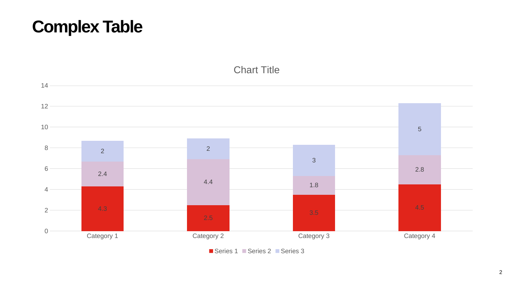
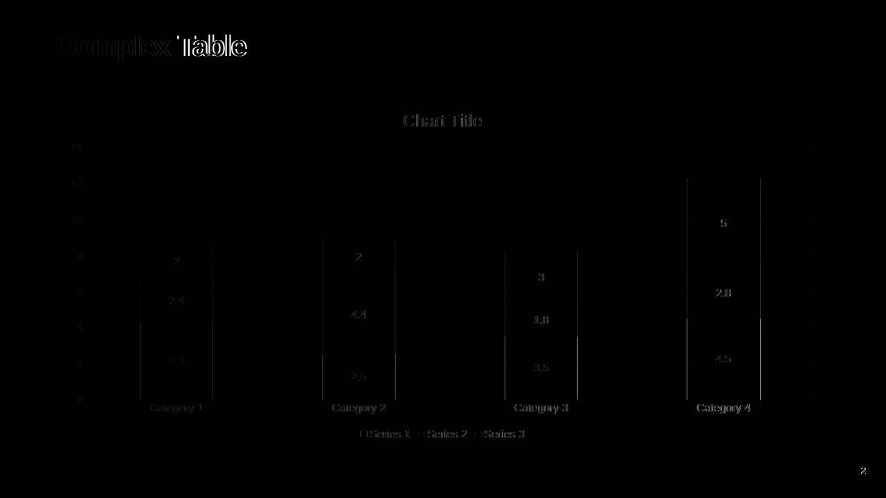
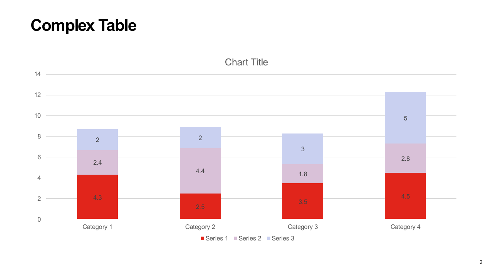
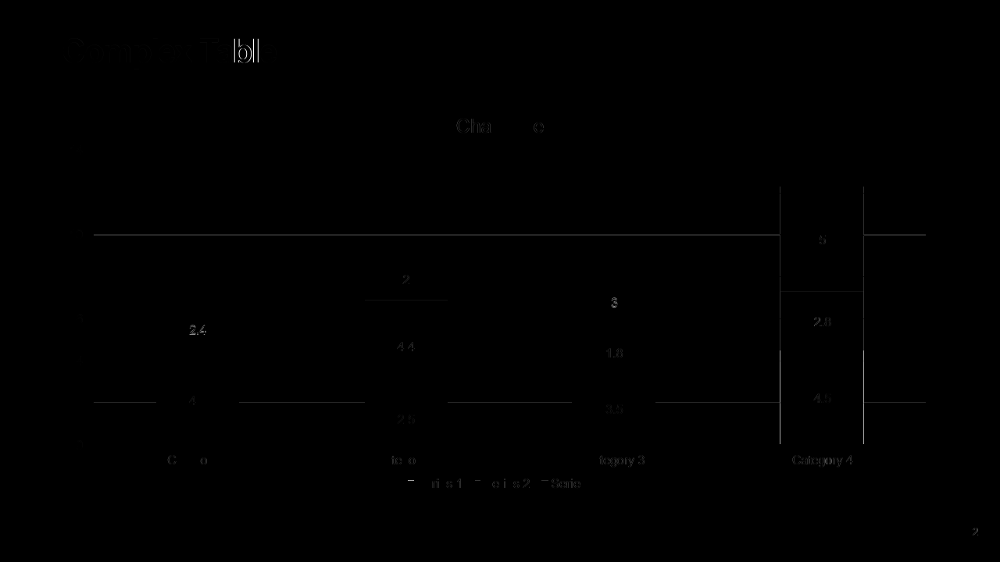

# Reverse Ingest Coverage Evidence

These artifacts cover the external chart slide used to prove first-class PPTX-ingest coverage.
The normalized HTML uses one renderer-backed chart element layer while retaining the exact chart
OPC graph for PPTX re-emission. Native title and slide-number visuals remain semantic HTML.

Raw candidates are committed instead of only comparison-aligned images. The HTML render is
2560x1440 for a 1280x720 source, and the LibreOffice round-trip render is 1281x720. Scoring resizes
them to the source canvas, while these files preserve the renderer's real output for inspection.

## PPTX To Normalized HTML

| LibreOffice source | Raw Chromium HTML | Difference heatmap |
|---|---|---|
|  |  |  |

Global `0.996`, regional `0.978`, structural `0.948`. Direct inspection confirms matching chart
bounds and content, title placement, legend, page number, and stacking. The remaining heatmap is
dominated by Chromium/LibreOffice font rasterization. The page number is an inherited PowerPoint
text field; this change recovers the field and its centered placeholder alignment instead of
silently omitting or left-aligning it.

## LibreOffice PPTX Round Trip

| Source PPTX | Raw round trip | Difference heatmap |
|---|---|---|
|  |  |  |

Global `0.998`, regional `0.990`, structural `0.993`. The exact chart graph is re-emitted and the
field/alignment fix removes the previously visible slide-number displacement.

## Microsoft Graph PPTX Round Trip

| PowerPoint source | Raw PowerPoint round trip | Difference heatmap |
|---|---|---|
|  |  |  |

Global `0.999`, regional `0.995`, structural `0.998`. Direct inspection confirms no missing or
displaced visual. Minor title glyph differences remain renderer/font output rather than structural
loss.
