# CSS Soft Edge Hybrid Evidence

Generated from `cap:soft-edge-effect` at 2560x1440. The source combines a two-axis intersecting
alpha mask, editable text, and overlapping foreground shapes. PowerPoint/Graph selects a
PowerPoint 2015 choice containing native `a:softEdge` beneath the isolated shape-bound layer;
LibreOffice selects the same picture alone.

| Path | Global | Regional | Structural |
|---|---:|---:|---:|
| LibreOffice | 0.993 | 0.966 | 0.983 |
| Microsoft Graph | 0.993 | 0.968 | 0.983 |
| PPTX -> normalized HTML | 0.996 | 0.979 | 0.997 |

Direct inspection confirms that the 14 px feather, teal fill, readable editable text, yellow
foreground bar, and red foreground badge remain present in every path. Differences are limited to
editable text metrics and edge antialiasing. The second regenerated cycle is 1.000
global/regional/structural, with one hybrid visual, two outputs, and exactly
`12193524000000` EMU2 of fallback area at every measured boundary.

A native-only Microsoft Graph probe scores 0.988 global, 0.948 regional, and 0.982 structural.
It confirms the emitted native effect is functional and editable, while also showing PowerPoint's
wider corner falloff; the production hybrid deliberately retains the inspected CSS paint above it.

## Source

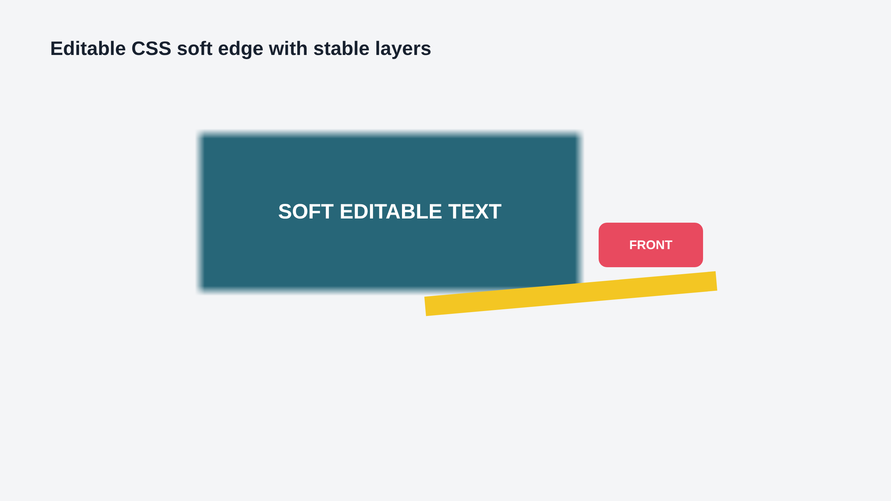

## LibreOffice

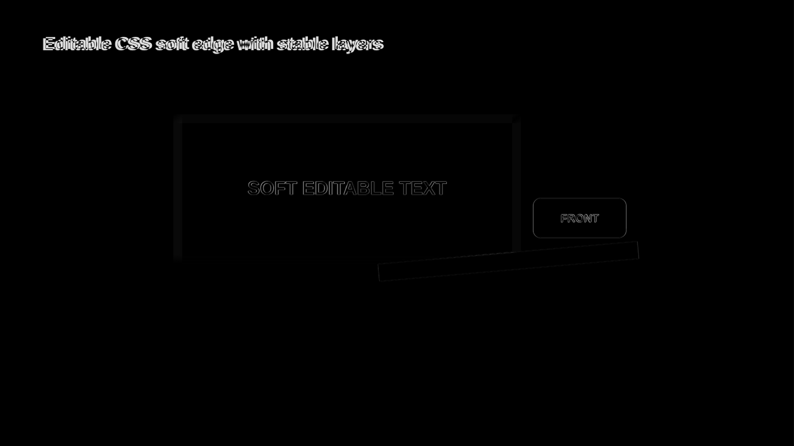

## Microsoft Graph

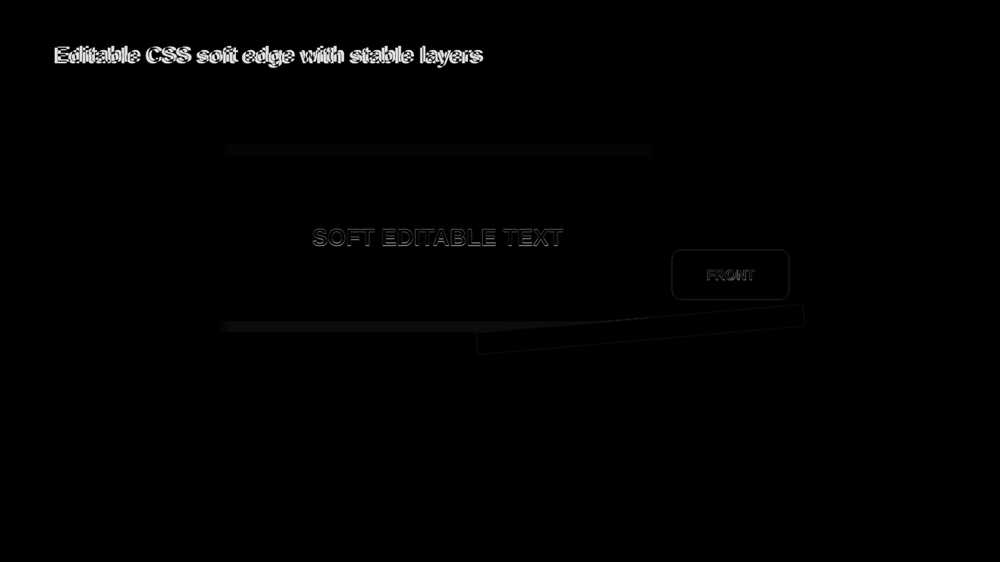

## Reverse HTML

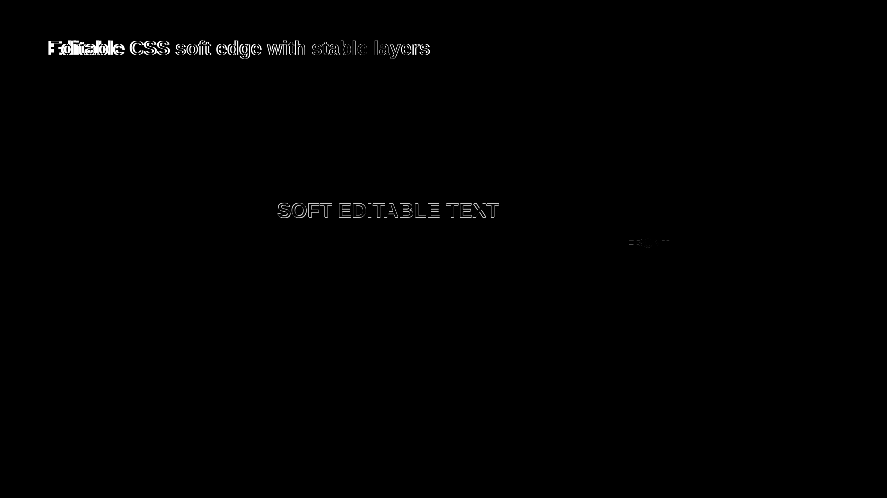

## Native PowerPoint Probe

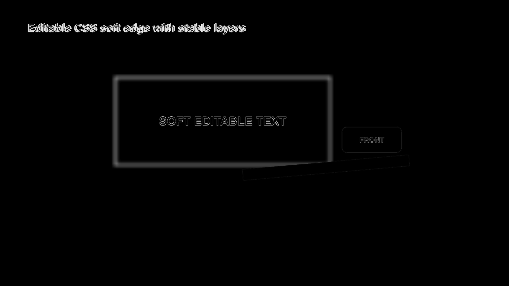

## External OfficeCLI Deck

The unmodified five-slide OfficeCLI effects deck contributes a slide combining zero/8pt/20pt
ellipse soft edges, hyperlinks, names, and overlapping z-order. Every radius and the hyperlink are
asserted in rebuilt XML. Geometry-aware radial masks improve the slide to 0.972 global / 0.851
regional / 0.625 focused / 0.822 structural in LibreOffice and 0.987 / 0.915 / 0.758 / 0.859 in
Graph. Direct inspection classifies the remaining difference as ellipse internal text-rectangle
placement, not a missing effect; the deliberately lower focused corpus floor records that debt.

| LibreOffice source | LibreOffice round trip | Diff |
|---|---|---|
| 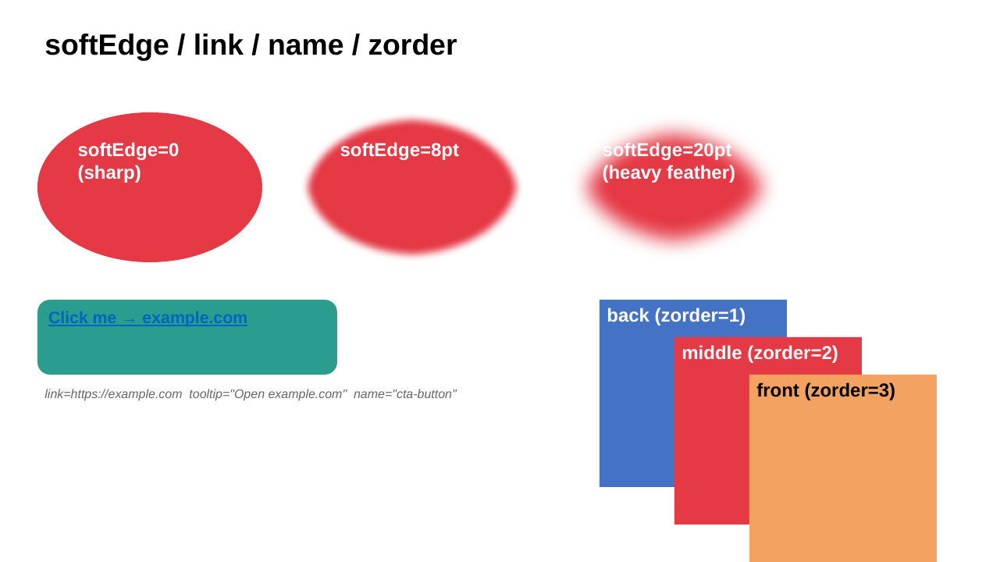 | 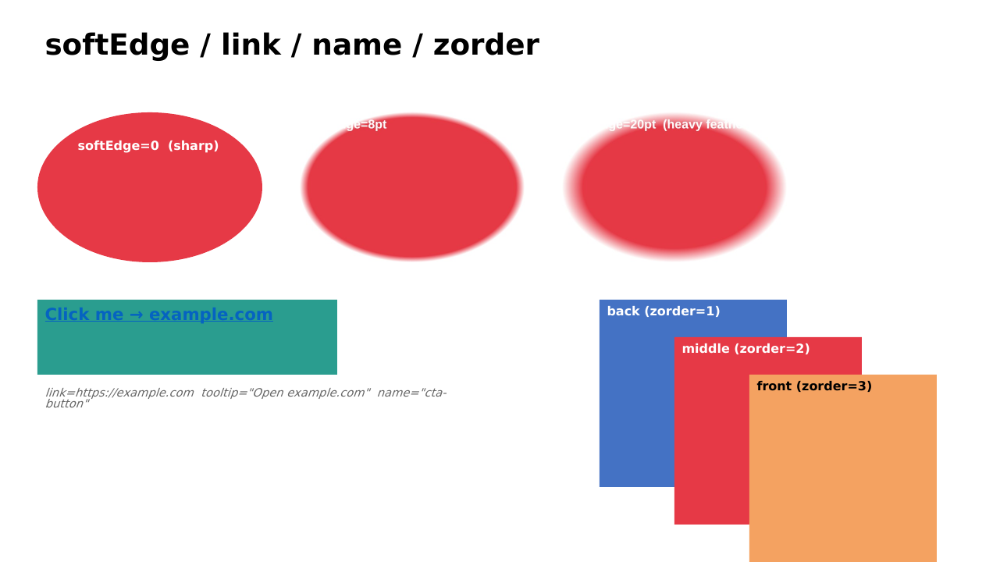 | 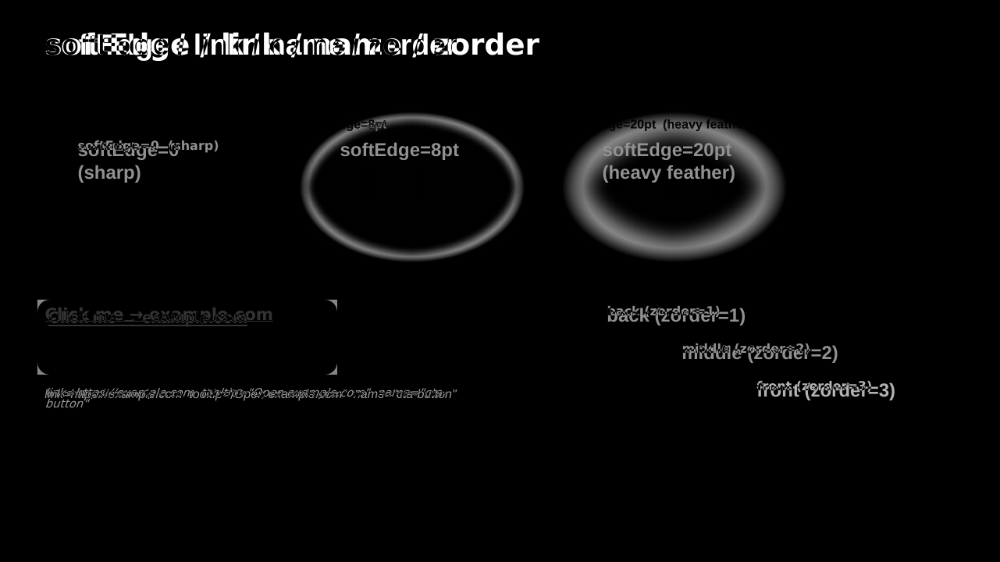 |

| Graph source | Graph round trip | Diff |
|---|---|---|
| 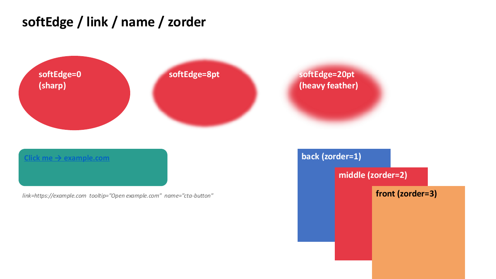 | 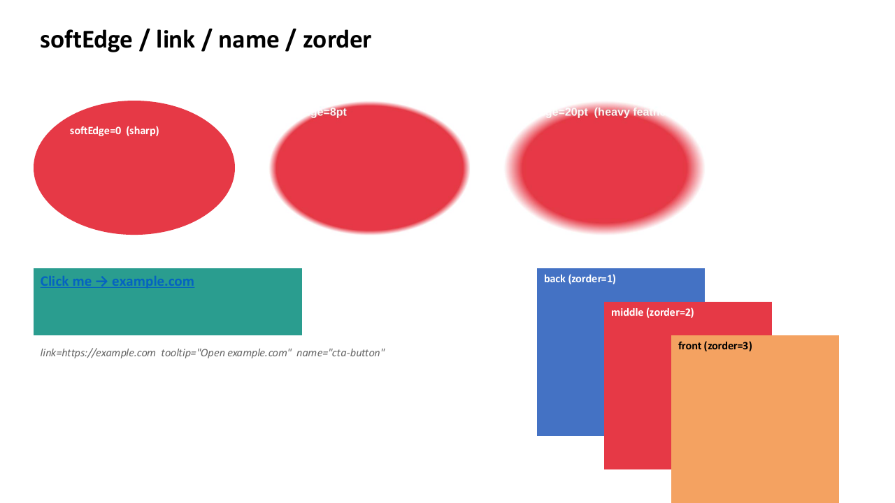 | 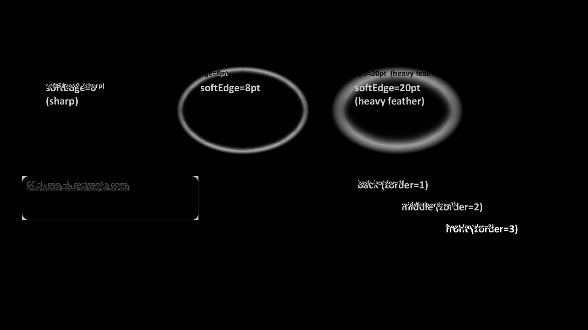 |
